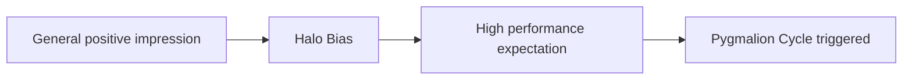

# Halo and Horns Effects

> Cognitive biases where an observer's overall impression of a person influences their feelings and thoughts about that character's specific traits or performance.

## Overview

The concept of [[Halo and Horns Effects]] is a fundamental part of the study of [[The Pygmalion Effect-Index]]. It represents a crucial component within the [[Counterparts and Related Phenomena]] subtopic. Structurally, it sits within the [[Applications and Critiques]] MOC of the topic. Understanding [[Halo and Horns Effects]] helps explain the broader cognitive and behavioral patterns of self-fulfilling interpersonal prophecies.

## Key Points

- **Halo Effect**: A positive general impression (e.g., physical attractiveness or pleasant personality) causes the evaluator to overestimate specific performance.
- **Horns Effect**: A negative general impression leads to an unfair underestimation of performance and character traits.
- **Interaction with Pygmalion**: These effects act as catalysts for the Pygmalion Effect, as the initial halo or horn impression dictates the expectations a leader forms.
- **Performance Evaluation Distortion**: These biases pose a major challenge in annual performance reviews, making objective assessment difficult.

## Diagram

## Connections

### Within The Pygmalion Effect
- [[Self-Fulfilling Prophecy]] — The initial impressions that establish the prophecy.
- [[Expectancy Bias]] — Biases that color the observer's subsequent expectations.
- [[The Pygmalion Cycle]] — Prepares the first stage of the cycle with positive or negative beliefs.
- [[Pygmalion in Management]] — Skews managerial expectations during recruitment and evaluation.
- [[Labeling and Ethical Implications]] — Contributes to unfair and discriminatory organizational labels.

### Cross-Domain
- [[Organizational Behavior]] — Studies leadership styles, employee engagement, and corporate culture.
- [[Sociology]] — Explores how group expectations and structural positions generate self-fulfilling prophecies.

## Sources

- Halo Effect on Wikipedia — https://en.wikipedia.org/wiki/Halo_effect
- Halo Effect in Britannica — https://www.britannica.com/science/halo-effect
- Horns Effect Overview (Healthline) — https://www.healthline.com/health/horns-effect

## Further Reading

- *A Constant Error in Psychological Ratings by Edward Thorndike* — the classic 1920 paper defining the Halo Effect

---
*Part of [[The Pygmalion Effect-Index]] · [[Applications and Critiques]] MOC · [[Counterparts and Related Phenomena]]*