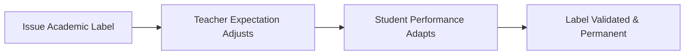

# Labeling and Ethical Implications

> The ethical considerations and social consequences of manipulating expectations and applying academic or behavioral labels to individuals.

## Overview

The concept of [[Labeling and Ethical Implications]] is a fundamental part of the study of [[The Pygmalion Effect-Index]]. It represents a crucial component within the [[Scientific Evaluation and Ethics]] subtopic. Structurally, it sits within the [[Applications and Critiques]] MOC of the topic. Understanding [[Labeling and Ethical Implications]] helps explain the broader cognitive and behavioral patterns of self-fulfilling interpersonal prophecies.

## Key Points

- **Ethical Dilemma of Deception**: The original Oak School study used active deception on teachers, raising concerns about informed consent in educational research.
- **Risk of Golem Harm**: Artificially lowering teacher expectations can result in permanent educational and psychological harm to students.
- **Implicit Bias Amplification**: Labels often align with gender, racial, or class stereotypes, locking systemic biases into scientific and administrative systems.
- **The Power of Labeling**: Once a label is officially applied (e.g., "slow learner" or "high potential"), it dictates funding, attention, and self-belief.

## Diagram

## Connections

### Within The Pygmalion Effect
- [[Oak School Study]] — Challenged the ethical standards of school research deception.
- [[Intellectual Bloomers Label]] — Examines the ethical use of arbitrary labels on children.
- [[The Golem Effect]] — Warns of the severe psychological harm of negative labeling.
- [[Replication and Methodological Critiques]] — Ethical critiques have shaped modern replication protocols.
- [[Pygmalion Effect Mitigation]] — Ethical issues drive the design of bias mitigation programs.

### Cross-Domain
- [[Sociology]] — Explores how group expectations and structural positions generate self-fulfilling prophecies.
- [[Educational Psychology]] — Focuses on teacher behavior, curriculum design, and student motivation.

## Sources

- Labeling Theory on Wikipedia — https://en.wikipedia.org/wiki/Labeling_theory
- Ethics of Expectancy Manipulation (PMC) — https://www.ncbi.nlm.nih.gov/pmc/articles/PMC4231208/
- Labeling in Special Education (Springer) — https://link.springer.com/referenceworkentry/10.1007/978-0-387-79061-9_1594

## Further Reading

- *Labeling Theory in Sociology by Howard Becker* — classic text on the social impacts of labeling

---
*Part of [[The Pygmalion Effect-Index]] · [[Applications and Critiques]] MOC · [[Scientific Evaluation and Ethics]]*