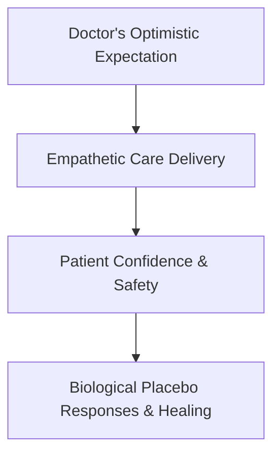

# Medical and Nursing Care

> The manifestation of expectancy effects in healthcare settings, where patient outcomes are influenced by the expectations of doctors, nurses, and the patients themselves.

## Overview

The concept of [[Medical and Nursing Care]] is a fundamental part of the study of [[The Pygmalion Effect-Index]]. It represents a crucial component within the [[Organizational and Educational Domains]] subtopic. Structurally, it sits within the [[Applications and Critiques]] MOC of the topic. Understanding [[Medical and Nursing Care]] helps explain the broader cognitive and behavioral patterns of self-fulfilling interpersonal prophecies.

## Key Points

- **Clinician Beliefs**: Caregivers who believe a patient has a high recovery potential often provide more attentive care, which leads to better patient outcomes.
- **Placebo Effect Connection**: The clinical efficacy of a drug is enhanced when the administering physician projects high confidence in its success.
- **Patient Self-Expectation**: Patients who internalize their doctor's optimistic expectations show higher rates of rehabilitation compliance and better recovery metrics.
- **Communication Cues**: Nurse expectations are transmitted through tone of voice, touch, and bedside manner, directly affecting patient stress and pain levels.

## Diagram

## Connections

### Within The Pygmalion Effect
- [[Interpersonal Expectancy Effects]] — Explores expectancies in caregiver-patient interactions.
- [[Climate Factor]] — Warm nursing care reduces patient physiological stress.
- [[The Pygmalion Cycle]] — Clinical expectations shape recovery compliance and outcomes.
- [[The Galatea Effect]] — Enhances patient self-efficacy and active rehabilitation efforts.
- [[The Golem Effect]] — Negative prognoses can result in a Golem-like health decline.

### Cross-Domain
- [[Clinical Psychology]] — Studies patient-therapist expectations and their role in therapeutic outcomes.
- [[Sociology]] — Explores how group expectations and structural positions generate self-fulfilling prophecies.

## Sources

- Expectancy and the Placebo Effect in Healthcare (PMC) — https://www.ncbi.nlm.nih.gov/pmc/articles/PMC6013051/
- Influence of Practitioner Expectations on Clinical Outcomes PubMed — https://pubmed.ncbi.nlm.nih.gov/11797241/
- Clinical Expectancy Studies — https://www.thelancet.com/journals/transcript-file

## Further Reading

- *The Placebo Effect in Clinical Practice by Fabrizio Benedetti* — excellent medical expectancy reference

---
*Part of [[The Pygmalion Effect-Index]] · [[Applications and Critiques]] MOC · [[Organizational and Educational Domains]]*