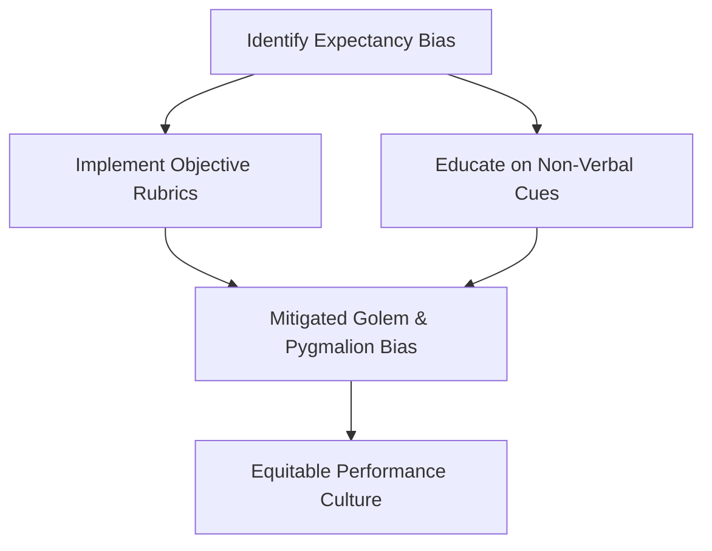

# Pygmalion Effect Mitigation

> The practical strategies, interventions, and structural designs used to reduce negative expectancy biases and foster equitable high performance.

## Overview

The concept of [[Pygmalion Effect Mitigation]] is a fundamental part of the study of [[The Pygmalion Effect-Index]]. It represents a crucial component within the [[Scientific Evaluation and Ethics]] subtopic. Structurally, it sits within the [[Applications and Critiques]] MOC of the topic. Understanding [[Pygmalion Effect Mitigation]] helps explain the broader cognitive and behavioral patterns of self-fulfilling interpersonal prophecies.

## Key Points

- **Awareness Training**: Educating managers and teachers about the Pygmalion and Golem effects helps them recognize and adjust their non-verbal cues.
- **Objective Assessment Tools**: Using standardized, objective performance rubrics reduces the room for selective interpretation and expectancy bias.
- **Growth Mindset Culture**: Promoting a growth mindset (the belief that abilities can be developed) aligns expectations with effort rather than fixed talent.
- **Structured Feedback Systems**: Implementing consistent feedback protocols ensures that all team members receive detailed, constructive suggestions.

## Diagram

## Connections

### Within The Pygmalion Effect
- [[Climate Factor]] — Mitigation aims to teach leaders to provide warm climate cues to everyone.
- [[Feedback Factor]] — Promotes objective, structured feedback to prevent bias.
- [[Expectancy Bias]] — Directly targets reducing expectancy biases in evaluations.
- [[The Golem Effect]] — Minimizes the risk of Golem effects in schools and teams.
- [[Labeling and Ethical Implications]] — Resolves the ethical problems of stereotyping.

### Cross-Domain
- [[Organizational Behavior]] — Studies leadership styles, employee engagement, and corporate culture.
- [[Educational Psychology]] — Focuses on teacher behavior, curriculum design, and student motivation.

## Sources

- Overcoming Expectation Bias in HBR — https://hbr.org/1969/07/pygmalion-in-management
- Interventions for Teacher Bias (ScienceDirect) — https://www.sciencedirect.com/science/article/pii/S095947521730030X
- MindTools on Mitigating the Pygmalion Effect — https://www.mindtools.com/pages/article/newTMM_73.htm

## Further Reading

- *Mindset: The New Psychology of Success by Carol Dweck* — details the growth mindset approach to expectations

---
*Part of [[The Pygmalion Effect-Index]] · [[Applications and Critiques]] MOC · [[Scientific Evaluation and Ethics]]*