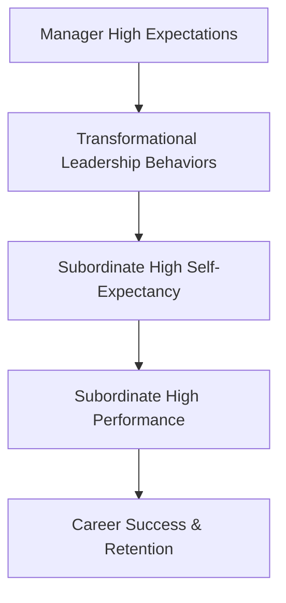

# Pygmalion in Management

> The application of expectancy theory to corporate leadership and human resource management, popularized by J. Sterling Livingston in 1969.

## Overview

The concept of [[Pygmalion in Management]] is a fundamental part of the study of [[The Pygmalion Effect-Index]]. It represents a crucial component within the [[Organizational and Educational Domains]] subtopic. Structurally, it sits within the [[Applications and Critiques]] MOC of the topic. Understanding [[Pygmalion in Management]] helps explain the broader cognitive and behavioral patterns of self-fulfilling interpersonal prophecies.

## Key Points

- **Livingston's Argument**: Livingston argued that a manager's expectations of their subordinates determine both the subordinates' performance and their career progress.
- **Managerial Self-Efficacy**: Managers who hold high expectations of their own capability are more likely to project high expectations onto their teams.
- **Early Career Impact**: The expectations set by an employee's first manager have a lasting impact, shaping their career path for years.
- **Transformational Leadership**: Transformational leaders leverage Pygmalion dynamics by communicating an inspiring vision and expressing confidence in their team's ability to achieve it.

## Diagram

## Connections

### Within The Pygmalion Effect
- [[Robert Rosenthal]] — Livingston applied Rosenthal's educational findings to corporate settings.
- [[Climate Factor]] — Managers communicate expectations through organizational climate.
- [[The Pygmalion Cycle]] — The cycle drives employee development and productivity.
- [[The Galatea Effect]] — High-expectancy management fosters employee self-expectations.
- [[The Golem Effect]] — Low managerial expectations trigger Golem-like performance drops.

### Cross-Domain
- [[Organizational Behavior]] — Studies leadership styles, employee engagement, and corporate culture.
- [[Sociology]] — Explores how group expectations and structural positions generate self-fulfilling prophecies.

## Sources

- Pygmalion in Management (Harvard Business Review) — https://hbr.org/1969/07/pygmalion-in-management
- Expectancy Effects in Organizations (ScienceDirect) — https://www.sciencedirect.com/science/article/pii/0749597890900388
- Forbes on Pygmalion in the Workplace — https://www.forbes.com/sites/forbescoachescouncil/2021/04/21/how-to-use-the-pygmalion-effect-to-boost-team-performance/

## Further Reading

- *Pygmalion in Management by J. Sterling Livingston* — the classic HBR article

---
*Part of [[The Pygmalion Effect-Index]] · [[Applications and Critiques]] MOC · [[Organizational and Educational Domains]]*