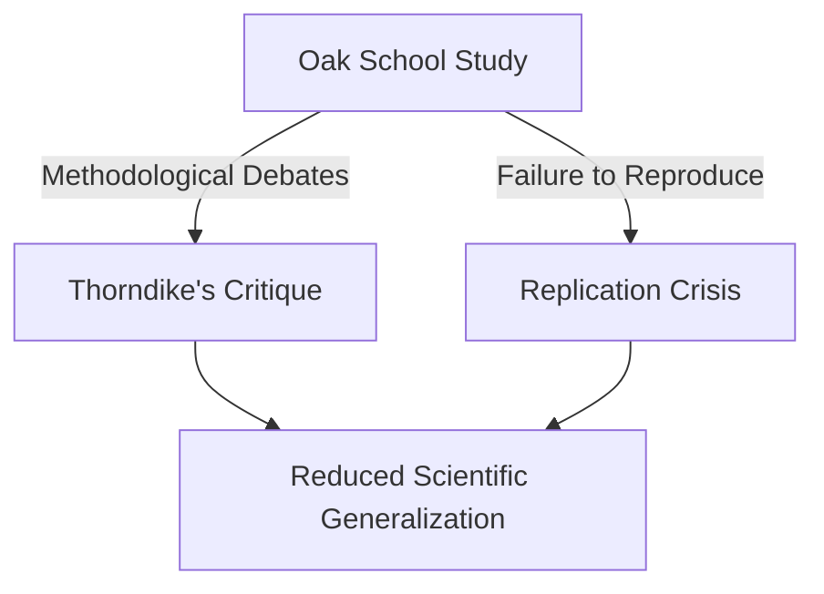

# Replication and Methodological Critiques

> The scientific controversies, debates, and empirical failures associated with replicating the Pygmalion Effect in psychological research.

## Overview

The concept of [[Replication and Methodological Critiques]] is a fundamental part of the study of [[The Pygmalion Effect-Index]]. It represents a crucial component within the [[Scientific Evaluation and Ethics]] subtopic. Structurally, it sits within the [[Applications and Critiques]] MOC of the topic. Understanding [[Replication and Methodological Critiques]] helps explain the broader cognitive and behavioral patterns of self-fulfilling interpersonal prophecies.

## Key Points

- **Replication Challenges**: Numerous attempts to replicate the original Oak School study have failed to produce statistically significant results, leading to questions about its generalizability.
- **Thorndike's Critique**: Educational psychologist Edward Thorndike published a sharp critique of the original study's IQ data, arguing that the test scores of younger children were psychometrically invalid.
- **Effect Size Debate**: Meta-analyses suggest that while interpersonal expectancy effects are real, their typical effect size is much smaller than originally reported.
- **Publication Bias**: Critics suggest that publication bias has skewed the literature toward reporting only positive Pygmalion effects while archiving null findings.

## Diagram

## Connections

### Within The Pygmalion Effect
- [[Robert Rosenthal]] — Rosenthal's studies were the primary focus of replication critics.
- [[Oak School Study]] — Critiqued for statistical anomalies and test reliability.
- [[Pygmalion in the Classroom]] — The book whose data was challenged by psychometricians.
- [[Expectancy Bias]] — Critics claim the original researchers fell victim to expectancy bias.
- [[Labeling and Ethical Implications]] — Debates have highlighted the ethical issues of replication studies.

### Cross-Domain
- [[Educational Psychology]] — Focuses on teacher behavior, curriculum design, and student motivation.
- [[Sociology]] — Explores how group expectations and structural positions generate self-fulfilling prophecies.

## Sources

- Replication Controversies on Wikipedia — https://en.wikipedia.org/wiki/Pygmalion_effect#Replication_controversies
- Thorndike's Review of Pygmalion (ScienceDirect) — https://www.sciencedirect.com/science/article/pii/002244057090013X
- Psychology Today on Pygmalion Validity — https://www.psychologytoday.com/us/blog/talking-apes/201808/can-we-trust-the-pygmalion-effect

## Further Reading

- *The Pygmalion Controversy by Donald Rubin* — detailed analysis of replication statistical power

---
*Part of [[The Pygmalion Effect-Index]] · [[Applications and Critiques]] MOC · [[Scientific Evaluation and Ethics]]*