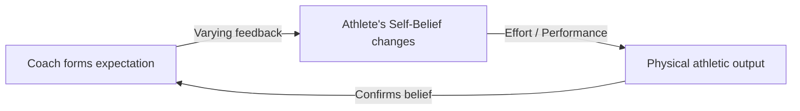

# Sports and Coaching Expectations

> The study of how a coach's expectations and evaluations of an athlete's potential influence the athlete's self-confidence, skill development, and athletic output.

## Overview

The concept of [[Sports and Coaching Expectations]] is a fundamental part of the study of [[The Pygmalion Effect-Index]]. It represents a crucial component within the [[Organizational and Educational Domains]] subtopic. Structurally, it sits within the [[Applications and Critiques]] MOC of the topic. Understanding [[Sports and Coaching Expectations]] helps explain the broader cognitive and behavioral patterns of self-fulfilling interpersonal prophecies.

## Key Points

- **Initial Assessment**: Coaches form immediate expectations based on physical stature, background, or early performance trials, which can be highly biased.
- **Behavioral Treatment**: Athletes labeled as high-potential receive more instruction, play-time, and emotional support, while low-potential athletes are marginalized.
- **Athletic Self-Efficacy**: The coach's behavior shapes the athlete's self-efficacy, causing them to perform up or down to the coach's expectations.
- **Physical Performance Confirmation**: The athlete's eventual physical output confirms the coach's initial evaluation, closing the cycle.

## Diagram

## Connections

### Within The Pygmalion Effect
- [[Climate Factor]] — Coaches communicate expectations through emotional climate on the field.
- [[Input Factor]] — High-potential athletes receive more technical instruction (input).
- [[Output Factor]] — Coaches give high-expectancy players more play-time and leadership roles.
- [[The Pygmalion Cycle]] — Drives athletic self-efficacy and eventual physical performance.
- [[The Galatea Effect]] — High coach belief translates to high athlete self-belief.

### Cross-Domain
- [[Sports Psychology]] — Investigates athletic motivation, coach-athlete relationships, and performance anxiety.
- [[Organizational Behavior]] — Studies leadership styles, employee engagement, and corporate culture.

## Sources

- Coach Expectations in Sports Psychology (ScienceDirect) — https://www.sciencedirect.com/topics/psychology/coach-expectation
- Expectations in Sport and Physical Activity PubMed Citation — https://pubmed.ncbi.nlm.nih.gov/22051624/
- APA Division 47 on Coach Expectations — https://www.apadivisions.org/division-47/publications/sportpsych-works/coach-expectations.pdf

## Further Reading

- *Expectancy Effects in Sport by Thelma Horn* — foundational research on coach-athlete expectancy interactions

---
*Part of [[The Pygmalion Effect-Index]] · [[Applications and Critiques]] MOC · [[Organizational and Educational Domains]]*