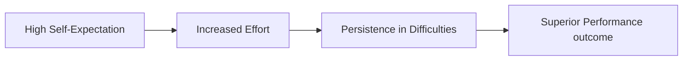

# The Galatea Effect

> A psychological phenomenon where an individual's own self-expectations and self-beliefs directly determine their performance.

## Overview

The concept of [[The Galatea Effect]] is a fundamental part of the study of [[The Pygmalion Effect-Index]]. It represents a crucial component within the [[Counterparts and Related Phenomena]] subtopic. Structurally, it sits within the [[Applications and Critiques]] MOC of the topic. Understanding [[The Galatea Effect]] helps explain the broader cognitive and behavioral patterns of self-fulfilling interpersonal prophecies.

## Key Points

- **Internal vs External**: While the Pygmalion Effect is driven by external expectations, the Galatea Effect is driven by internal self-expectations and self-efficacy.
- **Origin of the Name**: Named after Galatea, the statue carved by Pygmalion that came to life, symbolizing the internal transformation of the object of expectation.
- **Cognitive Mechanism**: High self-expectations increase effort, resilience in the face of failure, and cognitive processing efficiency.
- **Leadership Leverage**: Managers can trigger the Galatea Effect by coaching employees to build their self-efficacy, making them self-directed high achievers.

## Diagram

## Connections

### Within The Pygmalion Effect
- [[Ovid's Metamorphoses Myth]] — Named after the statue that was internally transformed into a living being.
- [[Self-Fulfilling Prophecy]] — The internal version of the self-fulfilling prophecy.
- [[The Pygmalion Cycle]] — Focuses on the self-belief stage of the Pygmalion cycle.
- [[The Golem Effect]] — Serves as a protective shield against the Golem Effect.
- [[Pygmalion in Management]] — Used by managers to build employee self-reliance.

### Cross-Domain
- [[Educational Psychology]] — Focuses on teacher behavior, curriculum design, and student motivation.
- [[Organizational Behavior]] — Studies leadership styles, employee engagement, and corporate culture.

## Sources

- Galatea Effect Section on Wikipedia — https://en.wikipedia.org/wiki/Pygmalion_effect#Galatea_effect
- Galatea Effect in Simply Psychology — https://www.simplypsychology.org/pygmalion-effect.html#galatea
- Self-Expectations in Management (HBR) — https://hbr.org/1969/07/pygmalion-in-management

## Further Reading

- *Self-Efficacy: The Exercise of Control by Albert Bandura* — unfolds the theory behind self-expectancy

---
*Part of [[The Pygmalion Effect-Index]] · [[Applications and Critiques]] MOC · [[Counterparts and Related Phenomena]]*