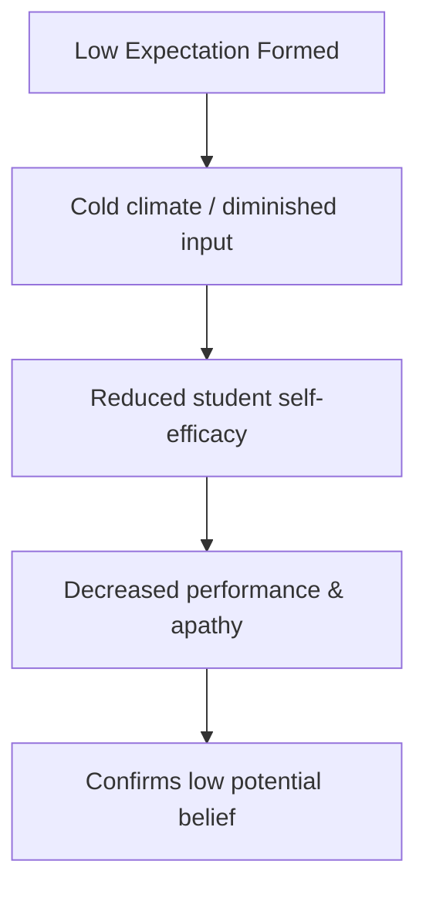

# The Golem Effect

> The negative counterpart of the Pygmalion Effect, where low expectations placed upon individuals by teachers or leaders lead to a decline in their performance.

## Overview

The concept of [[The Golem Effect]] is a fundamental part of the study of [[The Pygmalion Effect-Index]]. It represents a crucial component within the [[Counterparts and Related Phenomena]] subtopic. Structurally, it sits within the [[Applications and Critiques]] MOC of the topic. Understanding [[The Golem Effect]] helps explain the broader cognitive and behavioral patterns of self-fulfilling interpersonal prophecies.

## Key Points

- **Negative Expectancy**: The Golem Effect represents the destructive half of interpersonal expectancy theory, where leaders expect failure and unconsciously produce it.
- **Origin of the Name**: Named after the Golem of Jewish folklore, a clay creature created to serve but which ultimately turns destructive.
- **Vicious Cycle**: Low expectations lead to cold climate cues, reduced input, and poor feedback, which damages the target's self-esteem and leads to poor performance.
- **Systemic Bias**: The Golem Effect often reinforces racial, socioeconomic, or gender stereotypes, trapping marginalized individuals in cycles of low achievement.

## Diagram

## Connections

### Within The Pygmalion Effect
- [[Self-Fulfilling Prophecy]] — The negative variation of a self-fulfilling prophecy.
- [[Interpersonal Expectancy Effects]] — The negative manifestation of interpersonal expectancies.
- [[The Pygmalion Cycle]] — Follows the same cycle but with negative beliefs and inputs.
- [[The Galatea Effect]] — Destroys the self-efficacy needed for Galatea effects.
- [[Labeling and Ethical Implications]] — Demonstrates the severe harms of negative labeling.

### Cross-Domain
- [[Sociology]] — Explores how group expectations and structural positions generate self-fulfilling prophecies.
- [[Educational Psychology]] — Focuses on teacher behavior, curriculum design, and student motivation.

## Sources

- Golem Effect on Wikipedia — https://en.wikipedia.org/wiki/Golem_effect
- The Golem Effect in Management (ScienceDirect) — https://www.sciencedirect.com/science/article/pii/0090261682900344
- Golem Effect (The Decision Lab) — https://www.thedecisionlab.com/biases-effects/the-golem-effect

## Further Reading

- *The Golem Effect: A Meta-Analysis by Elisha Babad* — review of negative expectancies in educational environments

---
*Part of [[The Pygmalion Effect-Index]] · [[Applications and Critiques]] MOC · [[Counterparts and Related Phenomena]]*