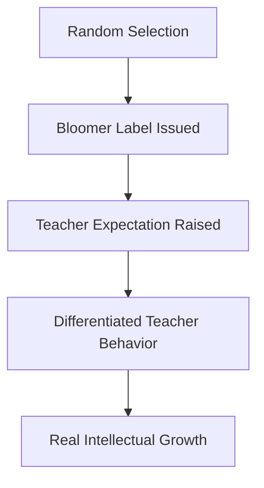

# Intellectual Bloomers Label

> The experimental label assigned to a random 20% subset of students in the Oak School study, presented to teachers as a reliable indicator of imminent intellectual growth.

## Overview

The concept of [[Intellectual Bloomers Label]] is a fundamental part of the study of [[The Pygmalion Effect-Index]]. It represents a crucial component within the [[The Landmark Experiment]] subtopic. Structurally, it sits within the [[Foundations]] MOC of the topic. Understanding [[Intellectual Bloomers Label]] helps explain the broader cognitive and behavioral patterns of self-fulfilling interpersonal prophecies.

## Key Points

- **Expectancy Catalyst**: The label "intellectual bloomers" was designed to create a positive expectancy bias in teachers' minds without implying that other students were deficient.
- **Randomization Control**: Because the labeled students were chosen entirely at random, any subsequent difference in their performance could be attributed solely to teacher expectations.
- **Teacher Behavior Alteration**: The label unconsciously modified how teachers interacted with the chosen students, leading to warmer body language, more frequent eye contact, and more detailed feedback.
- **Cognitive Priming**: The label acted as a cognitive lens, causing teachers to interpret the bloomers' mistakes as learning steps and their successes as proof of high intelligence.

## Diagram

## Connections

### Within The Pygmalion Effect
- [[Robert Rosenthal]] — Rosenthal designed this label to prime teacher expectations.
- [[Lenore Jacobson]] — Jacobson introduced the label to the school's teaching staff.
- [[Oak School Study]] — The core experimental manipulation of the 1968 study.
- [[Climate Factor]] — The label prompted teachers to create a warmer climate for selected students.
- [[Input Factor]] — Labeled students received richer, more challenging learning inputs.

### Cross-Domain
- [[Educational Psychology]] — Focuses on teacher behavior, curriculum design, and student motivation.
- [[Sociology]] — Explores how group expectations and structural positions generate self-fulfilling prophecies.

## Sources

- Intellectual Bloomers details on Wikipedia — https://en.wikipedia.org/wiki/Pygmalion_in_the_Classroom
- Simply Psychology on Bloomers Label — https://www.simplypsychology.org/pygmalion-effect.html
- Expectancy Priming in Education (Frontiers) — https://www.frontiersin.org/articles/10.3897/ap.2.e0123/full

## Further Reading

- *Pygmalion in the Classroom (1968)* — describes how the labeling was set up

---
*Part of [[The Pygmalion Effect-Index]] · [[Foundations]] MOC · [[The Landmark Experiment]]*