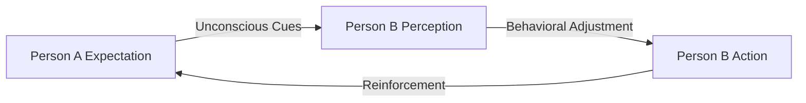

# Interpersonal Expectancy Effects

> The broad psychological phenomenon wherein one person's expectation of another's behavior comes to serve as a self-fulfilling prophecy.

## Overview

The concept of [[Interpersonal Expectancy Effects]] is a fundamental part of the study of [[The Pygmalion Effect-Index]]. It represents a crucial component within the [[Fundamental Theory]] subtopic. Structurally, it sits within the [[Foundations]] MOC of the topic. Understanding [[Interpersonal Expectancy Effects]] helps explain the broader cognitive and behavioral patterns of self-fulfilling interpersonal prophecies.

## Key Points

- **General Category**: This term represents the overarching scientific category that includes the Pygmalion Effect, the Golem Effect, and experimenter expectancy effects.
- **Unconscious Transmission**: The primary pathway for expectancy effects is subtle, non-verbal, and unconscious communication rather than explicit instruction.
- **Universal Presence**: Expectancy effects have been documented in laboratory experiments, schools, corporate offices, athletic arenas, and clinical therapy rooms.
- **Bidirectional Influence**: While traditional research focuses on top-down expectancy (e.g., teacher to student), newer research highlights how expectancies can be mutual and bottom-up.

## Diagram

## Connections

### Within The Pygmalion Effect
- [[Robert Rosenthal]] — Rosenthal pioneered the scientific study of these effects.
- [[Self-Fulfilling Prophecy]] — The theoretical framework under which interpersonal expectancies operate.
- [[The Pygmalion Cycle]] — The mechanism by which expectations are transmitted and confirmed.
- [[The Galatea Effect]] — Explores how self-expectancies interact with interpersonal expectancies.
- [[The Golem Effect]] — The negative valence of interpersonal expectancy.

### Cross-Domain
- [[Sociology]] — Explores how group expectations and structural positions generate self-fulfilling prophecies.
- [[Clinical Psychology]] — Studies patient-therapist expectations and their role in therapeutic outcomes.

## Sources

- Interpersonal Expectancy Effects on Wikipedia — https://en.wikipedia.org/wiki/Interpersonal_expectancy_effects
- Interpersonal Expectancy Effects (ScienceDirect) — https://www.sciencedirect.com/topics/psychology/interpersonal-expectancy-effect
- Interpersonal Expectancy Effects Academic Book — https://www.taylorfrancis.com/books/edit/10.4324/9780203774649/interpersonal-expectancy-effects-robert-rosenthal

## Further Reading

- *Interpersonal Expectancy Effects by Robert Rosenthal* — a comprehensive review of the field's early literature

---
*Part of [[The Pygmalion Effect-Index]] · [[Foundations]] MOC · [[Fundamental Theory]]*