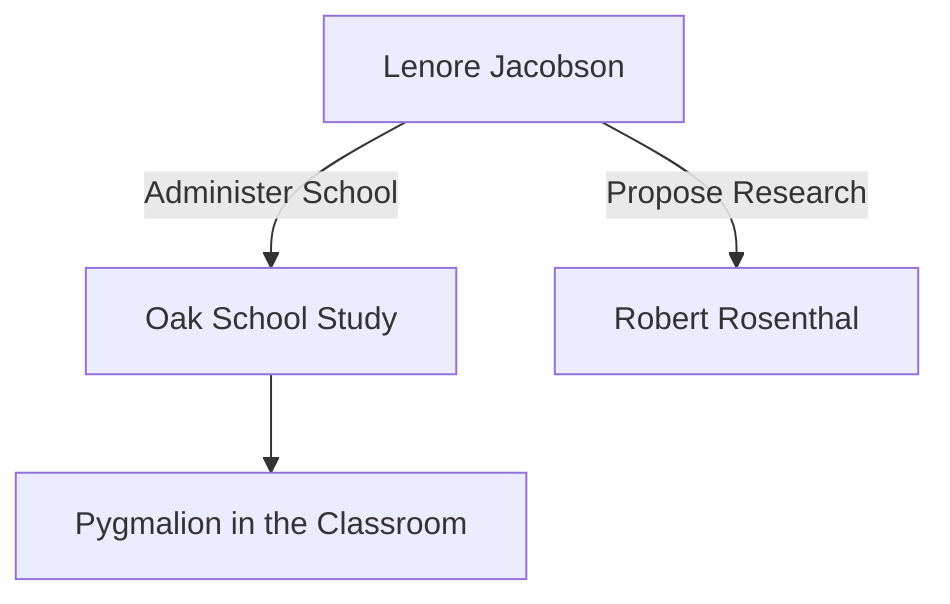

# Lenore Jacobson

> An American elementary school principal who co-authored the seminal 1968 study and book "Pygmalion in the Classroom" with Robert Rosenthal.

## Overview

The concept of [[Lenore Jacobson]] is a fundamental part of the study of [[The Pygmalion Effect-Index]]. It represents a crucial component within the [[Historical Context]] subtopic. Structurally, it sits within the [[Foundations]] MOC of the topic. Understanding [[Lenore Jacobson]] helps explain the broader cognitive and behavioral patterns of self-fulfilling interpersonal prophecies.

## Key Points

- **Educational Leadership**: Jacobson was the principal of West Park Elementary School in California (pseudonymously called Oak School) where the landmark study was conducted.
- **Connecting Theory to Practice**: She contacted Robert Rosenthal after reading about his research on experimenter expectancy effects, proposing that a similar effect might occur between teachers and students.
- **Facilitator of Research**: Jacobson's position allowed the researchers to implement the deceptive "Intellectual Bloomers" test without raising suspicion among teachers, securing authentic classroom conditions.
- **Seminal Co-Author**: Her collaboration with Rosenthal combined academic psychological research with practical, hands-on administrative expertise, making the book highly accessible to educators.

## Diagram

## Connections

### Within The Pygmalion Effect
- [[Robert Rosenthal]] — Partnered with Rosenthal to translate lab findings into school classrooms.
- [[Oak School Study]] — Facilitated and administered the study as the school's principal.
- [[Intellectual Bloomers Label]] — Allowed the deceptive student labeling to be implemented in her school.
- [[Pygmalion in the Classroom]] — Co-authored the book explaining the study's results and implications.
- [[Interpersonal Expectancy Effects]] — Explored how administrator and teacher expectancies shape student growth.

### Cross-Domain
- [[Educational Psychology]] — Focuses on teacher behavior, curriculum design, and student motivation.
- [[Sociology]] — Explores how group expectations and structural positions generate self-fulfilling prophecies.

## Sources

- Pygmalion in the Classroom on Wikipedia — https://en.wikipedia.org/wiki/Pygmalion_in_the_Classroom
- The Pygmalion Effect in Britannica — https://www.britannica.com/topic/Pygmalion-effect
- Contemporary reviews of Rosenthal & Jacobson (Taylor & Francis) — https://www.tandfonline.com/doi/abs/10.1080/00220671.1969.10883838

## Further Reading

- *Pygmalion in the Classroom by Rosenthal and Jacobson* — classic text detailing her collaboration

---
*Part of [[The Pygmalion Effect-Index]] · [[Foundations]] MOC · [[Historical Context]]*