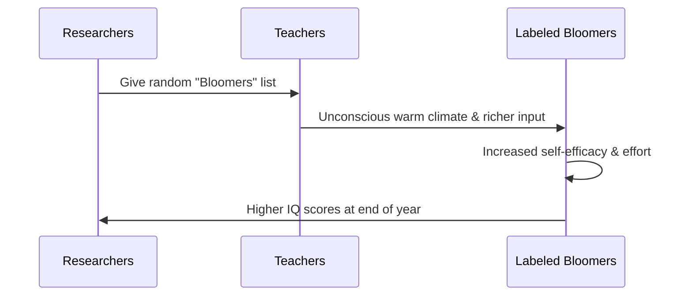

# Oak School Study

> The famous 1968 field experiment conducted by Robert Rosenthal and Lenore Jacobson in a California elementary school to test the effects of teacher expectations on student IQ growth.

## Overview

The concept of [[Oak School Study]] is a fundamental part of the study of [[The Pygmalion Effect-Index]]. It represents a crucial component within the [[The Landmark Experiment]] subtopic. Structurally, it sits within the [[Foundations]] MOC of the topic. Understanding [[Oak School Study]] helps explain the broader cognitive and behavioral patterns of self-fulfilling interpersonal prophecies.

## Key Points

- **Experimental Setup**: Teachers were told that a new test (the "Harvard Test of Inflected Acquisition") could predict which students were about to experience a rapid intellectual spurt.
- **Manipulated Expectations**: In reality, the test was a standard non-verbal IQ test, and the list of "intellectual bloomers" given to teachers was generated entirely at random.
- **IQ Measurement**: Students were tested at the beginning of the school year and re-tested at the end of the year to measure change in their intelligence scores.
- **Key Findings**: The randomly labeled "bloomers" showed significantly greater IQ gains, especially in the first and second grades, compared to the control group students.
- **Methodological Critique**: The study faced intense criticism regarding the reliability of the IQ test scores used for young children and the ethics of deceiving the school's teaching staff.

## Diagram

## Connections

### Within The Pygmalion Effect
- [[Robert Rosenthal]] — The principal researcher who designed the study's expectancy conditions.
- [[Lenore Jacobson]] — The school principal who facilitated the classroom experiment.
- [[Intellectual Bloomers Label]] — Used this random designation to manipulate teacher expectations.
- [[Pygmalion in the Classroom]] — The primary subject and empirical core of the 1968 book.
- [[Replication and Methodological Critiques]] — The target of major debates regarding replication and IQ validity.

### Cross-Domain
- [[Educational Psychology]] — Focuses on teacher behavior, curriculum design, and student motivation.
- [[Sociology]] — Explores how group expectations and structural positions generate self-fulfilling prophecies.

## Sources

- Oak School Study Details on Wikipedia — https://en.wikipedia.org/wiki/Pygmalion_in_the_Classroom
- Pygmalion Effect Overview (Simply Psychology) — https://www.simplypsychology.org/pygmalion-effect.html
- Original Pygmalion Study PubMed Citation — https://pubmed.ncbi.nlm.nih.gov/5663784/

## Further Reading

- *Pygmalion in the Classroom (1968)* — the formal monograph of the study

---
*Part of [[The Pygmalion Effect-Index]] · [[Foundations]] MOC · [[The Landmark Experiment]]*