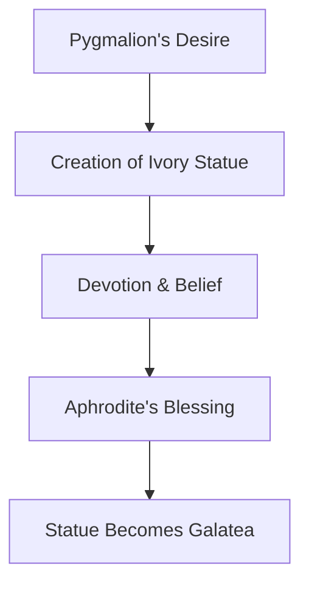

# Ovid's Metamorphoses Myth

> The narrative in Roman poet Ovid's Metamorphoses where the sculptor Pygmalion falls in love with his ivory statue, Galatea, which is then brought to life by the goddess Venus.

## Overview

The concept of [[Ovid's Metamorphoses Myth]] is a fundamental part of the study of [[The Pygmalion Effect-Index]]. It represents a crucial component within the [[Historical Context]] subtopic. Structurally, it sits within the [[Foundations]] MOC of the topic. Understanding [[Ovid's Metamorphoses Myth]] helps explain the broader cognitive and behavioral patterns of self-fulfilling interpersonal prophecies.

## Key Points

- **Origin of the Name**: The psychological Pygmalion Effect is named after the protagonist of this myth to represent how intense belief and desire can bring an expectation to life.
- **Ovid's Narrative**: In the Metamorphoses, Pygmalion is a Cypriot sculptor who, disgusted by the behavior of local women, vows celibacy and carves a statue of his ideal woman out of ivory.
- **Venus's Intervention**: Seeing Pygmalion's deep devotion and love for the statue during her festival, Venus grants his prayer and breathes life into the ivory figure, named Galatea in later traditions.
- **Psychological Symbolism**: The myth serves as a literary metaphor for the self-fulfilling prophecy, demonstrating how creative focus and expectation can shape objective reality.

## Diagram

## Connections

### Within The Pygmalion Effect
- [[Robert Rosenthal]] — Rosenthal used the name 'Pygmalion' from this myth to describe his expectancy findings.
- [[Lenore Jacobson]] — Co-authored the study named after this classical narrative.
- [[Self-Fulfilling Prophecy]] — Represents the foundational mythological illustration of a self-fulfilling prophecy.
- [[The Galatea Effect]] — The internal counterpart named after the statue brought to life in this myth.
- [[The Golem Effect]] — The negative expectation counterpart, named after a contrasting folklore figure.

### Cross-Domain
- [[Sociology]] — Explores how group expectations and structural positions generate self-fulfilling prophecies.
- [[Educational Psychology]] — Focuses on teacher behavior, curriculum design, and student motivation.

## Sources

- Pygmalion (mythology) on Wikipedia — https://en.wikipedia.org/wiki/Pygmalion_(mythology)
- Pygmalion in British Encyclopedia — https://www.britannica.com/topic/Pygmalion-Greek-mythology
- Ovid and the Metamorphoses (Met Museum) — https://www.metmuseum.org/toah/hd/poet/hd_poet.htm

## Further Reading

- *Metamorphoses by Ovid* — the primary classical source of the myth

---
*Part of [[The Pygmalion Effect-Index]] · [[Foundations]] MOC · [[Historical Context]]*