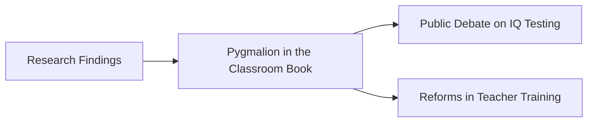

# Pygmalion in the Classroom

> The influential 1968 book authored by Robert Rosenthal and Lenore Jacobson that detailed the Oak School study and popularized the concept of interpersonal expectancy effects.

## Overview

The concept of [[Pygmalion in the Classroom]] is a fundamental part of the study of [[The Pygmalion Effect-Index]]. It represents a crucial component within the [[The Landmark Experiment]] subtopic. Structurally, it sits within the [[Foundations]] MOC of the topic. Understanding [[Pygmalion in the Classroom]] helps explain the broader cognitive and behavioral patterns of self-fulfilling interpersonal prophecies.

## Key Points

- **Public Impact**: The book bridged the gap between academic research and public interest, sparking national debates on educational equity and teacher expectations.
- **Theoretical Synthesis**: It compiled laboratory evidence on expectancy effects, historical literature on self-fulfilling prophecies, and empirical findings from the school experiment.
- **Critique of Tracking**: The authors argued that traditional educational tracking systems could act as permanent negative labels, artificially limiting student achievement.
- **Controversy and Debate**: Upon publication, the book was praised by social reformers but heavily criticized by psychometricians for perceived statistical errors.

## Diagram

## Connections

### Within The Pygmalion Effect
- [[Robert Rosenthal]] — Co-authored by Rosenthal to detail expectancy effects.
- [[Lenore Jacobson]] — Co-authored by Jacobson, bringing school administration perspective.
- [[Oak School Study]] — The book that published the full dataset of the Oak School experiment.
- [[Self-Fulfilling Prophecy]] — Popularized the self-fulfilling prophecy in modern educational psychology.
- [[Replication and Methodological Critiques]] — Prompted extensive criticism of its statistical methods.

### Cross-Domain
- [[Educational Psychology]] — Focuses on teacher behavior, curriculum design, and student motivation.
- [[Sociology]] — Explores how group expectations and structural positions generate self-fulfilling prophecies.

## Sources

- Pygmalion in the Classroom Book Page — https://en.wikipedia.org/wiki/Pygmalion_in_the_Classroom
- Healthline on Pygmalion in the Classroom — https://www.healthline.com/health/pygmalion-effect
- Internet Archive digital copy of Pygmalion in the Classroom — https://archive.org/details/pygmalioninclass00rose

## Further Reading

- *Pygmalion in the Classroom (1968)* — the primary text itself

---
*Part of [[The Pygmalion Effect-Index]] · [[Foundations]] MOC · [[The Landmark Experiment]]*