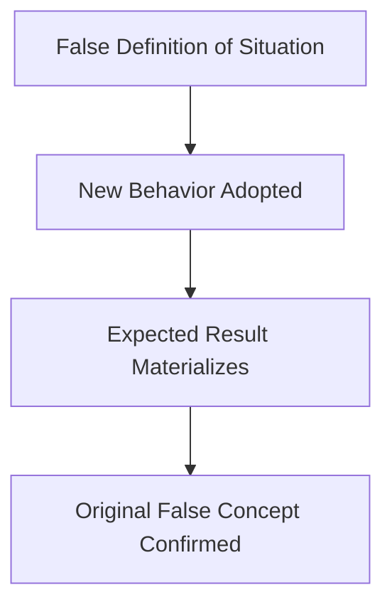

# Self-Fulfilling Prophecy

> A sociological and psychological concept coined by Robert K. Merton in 1948, where a false definition of a situation evokes a new behavior that makes the originally false conception come true.

## Overview

The concept of [[Self-Fulfilling Prophecy]] is a fundamental part of the study of [[The Pygmalion Effect-Index]]. It represents a crucial component within the [[Fundamental Theory]] subtopic. Structurally, it sits within the [[Foundations]] MOC of the topic. Understanding [[Self-Fulfilling Prophecy]] helps explain the broader cognitive and behavioral patterns of self-fulfilling interpersonal prophecies.

## Key Points

- **Theoretical Foundation**: The Pygmalion Effect is a specific interpersonal subcategory of the self-fulfilling prophecy, focusing on how one person's expectations shape another's actions.
- **Merton's Definition**: In his classic paper, Merton described how beliefs—even when entirely unfounded—alter behavior in ways that align external reality with those beliefs.
- **The Three-Stage Loop**: The prophecy operates in a loop: a belief is held, actions are taken in accordance with that belief, and those actions bring about the expected outcome.
- **Social Implications**: Merton used the concept to explain structural social phenomena, including bank runs and racial discrimination, highlighting the systemic power of collective expectations.

## Diagram

## Connections

### Within The Pygmalion Effect
- [[Robert Rosenthal]] — Rosenthal provided the first broad psychological evidence for this sociological concept.
- [[Pygmalion in the Classroom]] — The book that demonstrated the prophecy in educational settings.
- [[Interpersonal Expectancy Effects]] — The psychological subcategory describing how one's beliefs shape another's actions.
- [[The Pygmalion Cycle]] — The cognitive and behavioral loop that executes the prophecy.
- [[The Golem Effect]] — The negative variation of the self-fulfilling prophecy.

### Cross-Domain
- [[Sociology]] — Explores how group expectations and structural positions generate self-fulfilling prophecies.
- [[Behavioral Economics]] — Examines how market beliefs and expectations drive economic performance and bubbles.

## Sources

- Self-Fulfilling Prophecy on Wikipedia — https://en.wikipedia.org/wiki/Self-fulfilling_prophecy
- Self-Fulfilling Prophecy in Britannica — https://www.britannica.com/topic/self-fulfilling-prophecy
- Robert K. Merton Biography (ASA) — https://www.asanet.org/about/sociology-historical-perspective/robert-k-merton

## Further Reading

- *Social Theory and Social Structure by Robert K. Merton* — contains the original paper on self-fulfilling prophecies

---
*Part of [[The Pygmalion Effect-Index]] · [[Foundations]] MOC · [[Fundamental Theory]]*