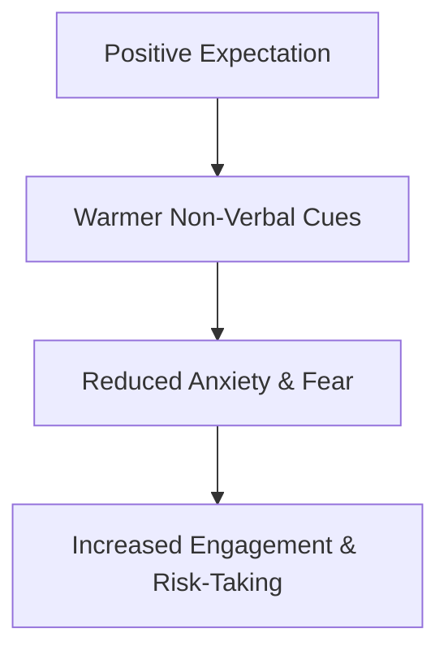

# Climate Factor

> The social-emotional warmth and supportive atmosphere created by an authority figure, representing the first element of Rosenthal's four-factor model.

## Overview

The concept of [[Climate Factor]] is a fundamental part of the study of [[The Pygmalion Effect-Index]]. It represents a crucial component within the [[The Four-Factor Model]] subtopic. Structurally, it sits within the [[Mechanisms]] MOC of the topic. Understanding [[Climate Factor]] helps explain the broader cognitive and behavioral patterns of self-fulfilling interpersonal prophecies.

## Key Points

- **Non-Verbal Cues**: Leaders and teachers express warmth through non-verbal channels such as smiling, nodding, leaning forward, and maintaining frequent eye contact.
- **Psychological Safety**: A warm climate fosters psychological safety, making individuals feel valued and lowering their performance anxiety.
- **Unconscious Expression**: Because climate is primarily non-verbal, leaders often create a supportive or hostile atmosphere without consciously realizing it.
- **Foundational Component**: Rosenthal identified climate as the most critical factor, as it establishes the emotional trust necessary for the other three factors to be effective.

## Diagram

## Connections

### Within The Pygmalion Effect
- [[Robert Rosenthal]] — Rosenthal identified Climate as the foundational factor of expectation communication.
- [[Intellectual Bloomers Label]] — Labeled students experienced a warmer climate from teachers.
- [[Input Factor]] — A warm climate establishes the trust needed to deliver challenging input.
- [[Output Factor]] — A supportive climate encourages individuals to verbalize outputs.
- [[Feedback Factor]] — Feedback is interpreted more constructively in a warm climate.

### Cross-Domain
- [[Educational Psychology]] — Focuses on teacher behavior, curriculum design, and student motivation.
- [[Organizational Behavior]] — Studies leadership styles, employee engagement, and corporate culture.

## Sources

- Climate Factor in Simply Psychology — https://www.simplypsychology.org/pygmalion-effect.html
- Pygmalion in Management (Harvard Business Review) — https://hbr.org/1969/07/pygmalion-in-management
- Classroom Climate Research (ScienceDirect) — https://www.sciencedirect.com/topics/social-sciences/classroom-climate

## Further Reading

- *The Four-Factor Model of Expectancy by Robert Rosenthal* — explains climate and its interaction with other factors

---
*Part of [[The Pygmalion Effect-Index]] · [[Mechanisms]] MOC · [[The Four-Factor Model]]*