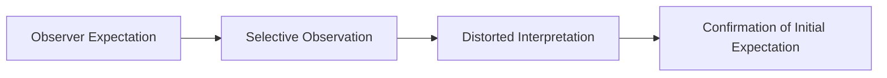

# Expectancy Bias

> A cognitive bias where an observer's preconceived expectations cause them to interpret evidence and evaluate performance in a way that confirms those expectations.

## Overview

The concept of [[Expectancy Bias]] is a fundamental part of the study of [[The Pygmalion Effect-Index]]. It represents a crucial component within the [[Psychological and Cognitive Cycles]] subtopic. Structurally, it sits within the [[Mechanisms]] MOC of the topic. Understanding [[Expectancy Bias]] helps explain the broader cognitive and behavioral patterns of self-fulfilling interpersonal prophecies.

## Key Points

- **Selective Attention**: Observers selectively notice behaviors that support their expectations while ignoring or discounting counter-evidence.
- **Interpretation Bias**: Ambiguous performance is interpreted positively for high-expectancy individuals and negatively for low-expectancy individuals.
- **Memory Distortion**: Observers are more likely to recall successes of high-expectancy subjects and failures of low-expectancy subjects.
- **Scientific Threat**: In clinical trials and behavioral research, expectancy bias can lead to false positive results, requiring double-blind protocols to control for it.

## Diagram

## Connections

### Within The Pygmalion Effect
- [[Robert Rosenthal]] — Rosenthal studied this bias to control experimenter expectancy effects.
- [[Self-Fulfilling Prophecy]] — The cognitive bias that initiates and preserves the prophecy.
- [[The Pygmalion Cycle]] — The bias that reinforces the first stage of the cycle.
- [[Halo and Horns Effects]] — Cognitive biases that form the foundation of expectancy bias.
- [[Replication and Methodological Critiques]] — Critics claim the original researchers fell victim to expectancy bias.

### Cross-Domain
- [[Clinical Psychology]] — Studies patient-therapist expectations and their role in therapeutic outcomes.
- [[Sociology]] — Explores how group expectations and structural positions generate self-fulfilling prophecies.

## Sources

- Observer-Expectancy Effect on Wikipedia — https://en.wikipedia.org/wiki/Observer-expectancy_effect
- Expectancy Bias in ScienceDirect — https://www.sciencedirect.com/topics/psychology/expectancy-bias
- Experimenter Effects in Behavioral Research (APA) — https://www.apa.org/pubs/books/4318012

## Further Reading

- *Observer Effects in Science by Donald Rubin* — analyzes scientific and observational expectancy biases

---
*Part of [[The Pygmalion Effect-Index]] · [[Mechanisms]] MOC · [[Psychological and Cognitive Cycles]]*