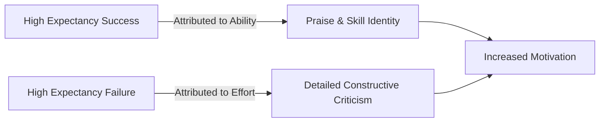

# Feedback Factor

> The qualitative difference in feedback provided to individuals, where high-expectancy subjects receive more praise, constructive criticism, and detailed corrections compared to low-expectancy subjects.

## Overview

The concept of [[Feedback Factor]] is a fundamental part of the study of [[The Pygmalion Effect-Index]]. It represents a crucial component within the [[The Four-Factor Model]] subtopic. Structurally, it sits within the [[Mechanisms]] MOC of the topic. Understanding [[Feedback Factor]] helps explain the broader cognitive and behavioral patterns of self-fulfilling interpersonal prophecies.

## Key Points

- **Praise Differentiation**: High-expectancy individuals are praised more for correct answers, whereas low-expectancy individuals are often praised for mediocre or incorrect answers as a form of patronizing comfort.
- **Constructive Correction**: When high-expectancy individuals fail, they receive detailed explanations of their errors because the leader believes they have the capacity to improve.
- **Attribution of Success**: Successes of high-expectancy individuals are attributed to their ability, while failures are attributed to effort; the reverse is true for low-expectancy individuals.
- **Motivational Impact**: Detailed, constructive feedback motivates individuals to correct errors and persist through difficult tasks.

## Diagram

## Connections

### Within The Pygmalion Effect
- [[Robert Rosenthal]] — Rosenthal identified feedback as the corrective channel of expectancy.
- [[Climate Factor]] — Emotional climate determines how feedback is received and internalized.
- [[Input Factor]] — Complex input requires constructive feedback to be mastered.
- [[Output Factor]] — Feedback is directly given in response to the subject's output.
- [[The Pygmalion Cycle]] — Constructive feedback reinforces high performance and self-belief.

### Cross-Domain
- [[Educational Psychology]] — Focuses on teacher behavior, curriculum design, and student motivation.
- [[Organizational Behavior]] — Studies leadership styles, employee engagement, and corporate culture.

## Sources

- Feedback Factor in Simply Psychology — https://www.simplypsychology.org/pygmalion-effect.html
- Feedback Factor (The Decision Lab) — https://www.thedecisionlab.com/biases-effects/the-pygmalion-effect
- Teacher Feedback and Expectancy Effects (Springer) — https://link.springer.com/chapter/10.1007/978-3-030-80412-1_5

## Further Reading

- *The Power of Feedback by John Hattie* — reinforces how feedback style drives performance

---
*Part of [[The Pygmalion Effect-Index]] · [[Mechanisms]] MOC · [[The Four-Factor Model]]*