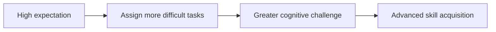

# Input Factor

> The tendency of teachers or leaders to deliver more instructional material, assign more difficult tasks, and offer richer content to individuals for whom they hold high expectations.

## Overview

The concept of [[Input Factor]] is a fundamental part of the study of [[The Pygmalion Effect-Index]]. It represents a crucial component within the [[The Four-Factor Model]] subtopic. Structurally, it sits within the [[Mechanisms]] MOC of the topic. Understanding [[Input Factor]] helps explain the broader cognitive and behavioral patterns of self-fulfilling interpersonal prophecies.

## Key Points

- **Material Richness**: High-expectancy individuals are exposed to a broader, more challenging curriculum compared to low-expectancy peers who receive repetitive or simplified assignments.
- **Opportunity to Learn**: By adjusting the input, leaders dictate the upper boundary of what the individual is allowed to learn and master.
- **Differentiation Bias**: This bias manifests when managers reserve high-profile projects for favored employees, denying growth opportunities to others.
- **Reinforcing Feedback Loops**: The rich input enables the individual to develop advanced skills, which then validates the leader's initial high expectation.

## Diagram

## Connections

### Within The Pygmalion Effect
- [[Robert Rosenthal]] — Defined the input factor in teacher expectation transmission.
- [[Climate Factor]] — Warm climate enables the successful delivery of advanced input.
- [[Output Factor]] — Rich input provides the material necessary for high-quality output.
- [[Feedback Factor]] — Complex input requires detailed feedback to guide learning.
- [[The Pygmalion Cycle]] — Differentiated input is a key behavioral action in the cycle.

### Cross-Domain
- [[Educational Psychology]] — Focuses on teacher behavior, curriculum design, and student motivation.
- [[Organizational Behavior]] — Studies leadership styles, employee engagement, and corporate culture.

## Sources

- Input Factor in Simply Psychology — https://www.simplypsychology.org/pygmalion-effect.html
- HBR Pygmalion Article — https://hbr.org/1969/07/pygmalion-in-management
- Interpersonal Expectations in Classrooms (PMC) — https://www.ncbi.nlm.nih.gov/pmc/articles/PMC8900690/

## Further Reading

- *Differentiated Instruction and Expectancy Theory* — discusses how input variations affect student achievement

---
*Part of [[The Pygmalion Effect-Index]] · [[Mechanisms]] MOC · [[The Four-Factor Model]]*