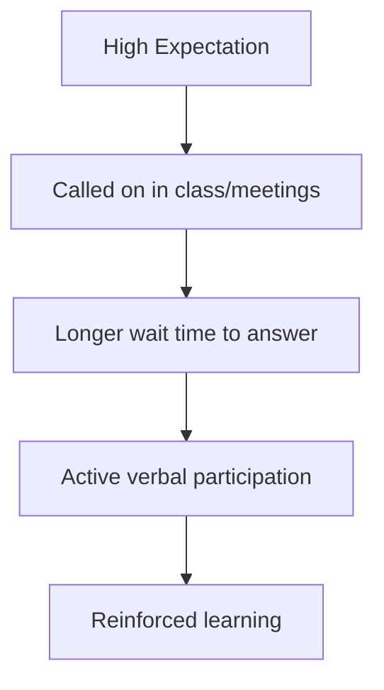

# Output Factor

> The behavior where teachers or managers offer high-expectancy individuals more opportunities to speak, respond, ask questions, and lead, representing the third element in Rosenthal's four-factor model.

## Overview

The concept of [[Output Factor]] is a fundamental part of the study of [[The Pygmalion Effect-Index]]. It represents a crucial component within the [[The Four-Factor Model]] subtopic. Structurally, it sits within the [[Mechanisms]] MOC of the topic. Understanding [[Output Factor]] helps explain the broader cognitive and behavioral patterns of self-fulfilling interpersonal prophecies.

## Key Points

- **Participation Opportunity**: High-expectancy individuals are called on more frequently and are given more time to formulate and express their thoughts.
- **Active Engagement**: This factor encourages active learning and participation, which are critical drivers of academic and professional skill acquisition.
- **Non-Verbal Encouragement**: Managers prompt high-expectancy employees for input during meetings and show active listening behaviors while they speak.
- **Confidence Building**: The repeated experience of being asked for input and having it listened to builds self-efficacy and public speaking confidence.

## Diagram

## Connections

### Within The Pygmalion Effect
- [[Robert Rosenthal]] — Rosenthal included output as the third factor in his model.
- [[Climate Factor]] — Warm climate encourages subjects to take risks in their output.
- [[Input Factor]] — Rich input provides the knowledge base needed for output.
- [[Feedback Factor]] — Output is the behavior that leaders evaluate and provide feedback on.
- [[The Pygmalion Cycle]] — Subject output confirms the observer's initial beliefs.

### Cross-Domain
- [[Educational Psychology]] — Focuses on teacher behavior, curriculum design, and student motivation.
- [[Organizational Behavior]] — Studies leadership styles, employee engagement, and corporate culture.

## Sources

- Output Factor in Simply Psychology — https://www.simplypsychology.org/pygmalion-effect.html
- Output Factor (The Decision Lab) — https://www.thedecisionlab.com/biases-effects/the-pygmalion-effect
- Pygmalion in Organizations Research — https://www.erudit.org/en/journals/mefa/1900-v1-n1-mefa0123/

## Further Reading

- *Active Participation and Student Outcome Meta-analysis* — validates the importance of the output factor

---
*Part of [[The Pygmalion Effect-Index]] · [[Mechanisms]] MOC · [[The Four-Factor Model]]*