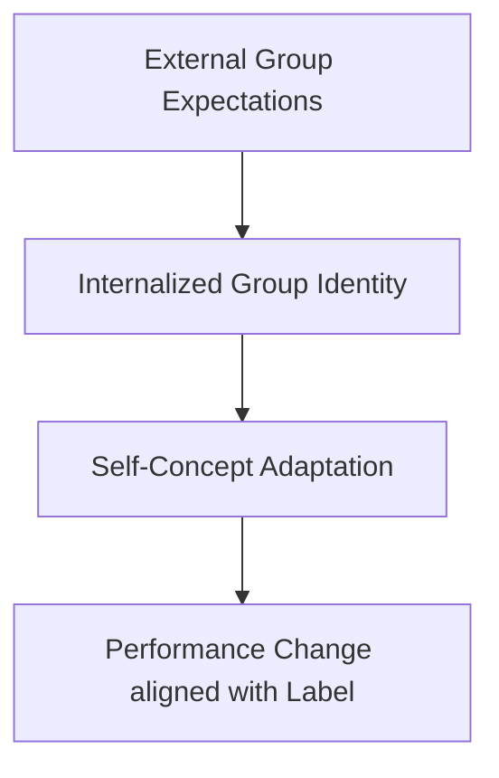

# Social Identity Theory Connection

> The conceptual intersection showing how labeling and external expectations shape an individual's self-concept and group identity, influencing performance.

## Overview

The concept of [[Social Identity Theory Connection]] is a fundamental part of the study of [[The Pygmalion Effect-Index]]. It represents a crucial component within the [[Psychological and Cognitive Cycles]] subtopic. Structurally, it sits within the [[Mechanisms]] MOC of the topic. Understanding [[Social Identity Theory Connection]] helps explain the broader cognitive and behavioral patterns of self-fulfilling interpersonal prophecies.

## Key Points

- **Label Internalization**: Social Identity Theory, pioneered by Henri Tajfel, explains that individuals internalize the labels and expectations placed upon their social group.
- **Stereotype Threat**: Negative group expectations can induce performance anxiety and lead to a decline in achievement, a phenomenon closely tied to the Golem Effect.
- **In-Group favoritism**: Teachers or managers may project higher expectations onto individuals they identify as part of their in-group, reinforcing systemic inequality.
- **Self-Concept Alteration**: External expectancies gradually modify an individual's self-schema, aligning their personal identity with external assessments.

## Diagram

## Connections

### Within The Pygmalion Effect
- [[Self-Fulfilling Prophecy]] — Group labels can act as structural self-fulfilling prophecies.
- [[The Pygmalion Cycle]] — Explains how external cycles shape self-concept and group identity.
- [[The Galatea Effect]] — Explores how social identity drives internal self-expectations.
- [[The Golem Effect]] — Stereotype threat is a collective manifestation of the Golem Effect.
- [[Labeling and Ethical Implications]] — Highlights the ethical issues of applying demographic labels.

### Cross-Domain
- [[Sociology]] — Explores how group expectations and structural positions generate self-fulfilling prophecies.
- [[Educational Psychology]] — Focuses on teacher behavior, curriculum design, and student motivation.

## Sources

- Social Identity Theory on Wikipedia — https://en.wikipedia.org/wiki/Social_identity_theory
- Social Identity Theory in ScienceDirect — https://www.sciencedirect.com/topics/psychology/social-identity-theory
- Simply Psychology on Social Identity Theory — https://www.simplypsychology.org/social-identity-theory.html

## Further Reading

- *Stereotype Threat by Claude Steele* — provides details on negative expectancy internalized by minority groups

---
*Part of [[The Pygmalion Effect-Index]] · [[Mechanisms]] MOC · [[Psychological and Cognitive Cycles]]*