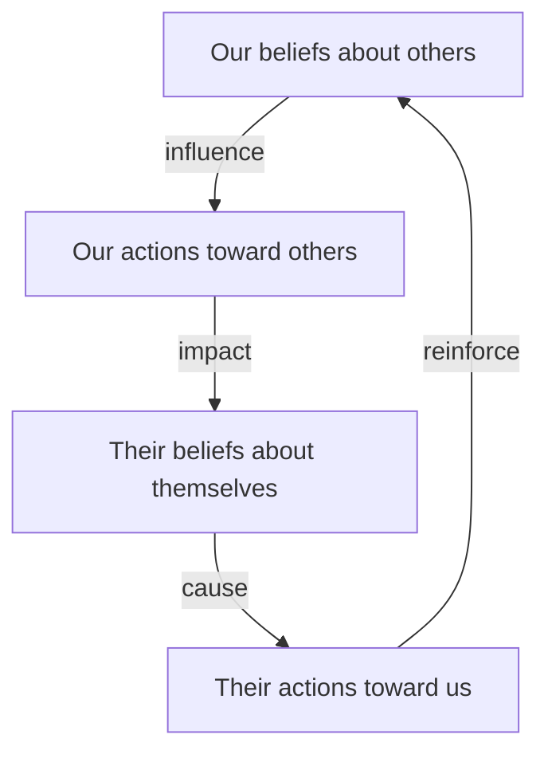

# The Pygmalion Cycle

> The self-reinforcing, four-stage feedback loop that illustrates how one's expectations of others influence their behavior and shape the other's self-concept and performance.

## Overview

The concept of [[The Pygmalion Cycle]] is a fundamental part of the study of [[The Pygmalion Effect-Index]]. It represents a crucial component within the [[Psychological and Cognitive Cycles]] subtopic. Structurally, it sits within the [[Mechanisms]] MOC of the topic. Understanding [[The Pygmalion Cycle]] helps explain the broader cognitive and behavioral patterns of self-fulfilling interpersonal prophecies.

## Key Points

- **Four Stages**: The cycle begins with (1) Our beliefs about others, which drive (2) Our actions towards them, which shape (3) Their beliefs about themselves, which influence (4) Their actions back towards us, reinforcing our initial beliefs.
- **Cognitive Loop**: It operates as a feedback loop where the observer's expectations act as the input and the target's behavior acts as the confirming output.
- **Interpersonal System**: The cycle demonstrates that human performance is not an isolated individual trait but an emergent outcome of interpersonal relationships.
- **Intervention Points**: Knowing the cycle allows managers and teachers to intentionally break negative loops by raising expectations or modifying climate behaviors.

## Diagram

## Connections

### Within The Pygmalion Effect
- [[Self-Fulfilling Prophecy]] — The cycle represents the psychological operationalization of the prophecy.
- [[Interpersonal Expectancy Effects]] — Explains the transmission dynamics of expectancy effects.
- [[Climate Factor]] — Climate serves as the non-verbal channel of the cycle's second stage.
- [[Expectancy Bias]] — Priming beliefs in the cycle's first stage.
- [[The Galatea Effect]] — The third stage of the cycle (self-belief) represents the Galatea Effect.

### Cross-Domain
- [[Sociology]] — Explores how group expectations and structural positions generate self-fulfilling prophecies.
- [[Organizational Behavior]] — Studies leadership styles, employee engagement, and corporate culture.

## Sources

- The Pygmalion Cycle on The Decision Lab — https://www.thedecisionlab.com/biases-effects/the-pygmalion-effect
- Pygmalion Cycle in HBR — https://hbr.org/1969/07/pygmalion-in-management
- Verywell Mind on Pygmalion Cycle — https://www.verywellmind.com/what-is-the-pygmalion-effect-5089758

## Further Reading

- *Interpersonal Expectations by Robert Rosenthal* — discusses the cycle and reinforcement patterns

---
*Part of [[The Pygmalion Effect-Index]] · [[Mechanisms]] MOC · [[Psychological and Cognitive Cycles]]*