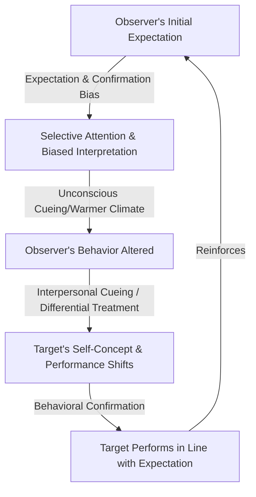

# Research Notes: Expectation Bias and Confirmation Bias in the Pygmalion Effect

**Date:** 2026-07-12  
**Topic:** The Pygmalion Effect  
**Subtopic:** Core Cognitive & Social Psychology Concepts  
**Concept:** Expectation Bias and Confirmation Bias  

---

## 1. Conceptual Definitions and Distinctions

### Expectation Bias (Expectancy Bias)
Expectation bias is a cognitive bias where an individual's preconceived notions, predictions, or mental templates about an outcome significantly influence how they perceive, interpret, and respond to information. 
* **Mechanism:** The brain uses prior expectations to "fill in gaps" in sensory input, meaning observers literally see or hear what they expect to see or hear.
* **Role in Pygmalion Effect:** When an observer (e.g., a teacher or manager) holds a prior expectation about a target's potential (e.g., "this student is late-blooming/high-potential"), their expectation acts as a cognitive filter. They anticipate positive behaviors and high-quality performance.

### Confirmation Bias
Confirmation bias is the overarching cognitive tendency to search for, interpret, favor, and recall information in a way that confirms one's preexisting beliefs or hypotheses while ignoring or discounting conflicting evidence.
* **Mechanism:** Operates via three primary cognitive processes:
  1. **Selective Attention (Notice):** Unconsciously focusing on stimuli that align with expectations.
  2. **Biased Interpretation:** Framing ambiguous actions or data to fit a preexisting theory.
  3. **Selective Recall:** Remembering details that support the expectation while forgetting contradictory evidence.
* **Role in Pygmalion Effect:** Once an expectation is set, the observer selectively notices behaviors that validate it (e.g., noticing when a "gifted" student's hand is raised, while ignoring when they get distracted).

---

## 2. Interaction and Cognitive-Behavioral Feedback Loop

The Pygmalion Effect is sustained by a continuous loop where internal cognitive biases (Expectation and Confirmation Bias) drive interpersonal behaviors, leading to behavioral confirmation.

### The Four Steps of the Behavioral Confirmation Process
1. **Observer's Expectation:** The observer forms a belief about the target.
2. **Observer's Treatment:** Guided by expectation and confirmation biases, the observer alters their behavior towards the target (e.g., providing more eye contact, warmer tone, more challenging tasks, and constructive feedback).
3. **Target's Response:** The target internalizes the differential treatment, which boosts self-efficacy, motivation, and effort.
4. **Behavioral Confirmation:** The target behaves in a manner that matches the observer's initial expectation. The observer notes this behavior as "proof" of their original belief, ignoring any intermediate role they played in creating it.

---

## 3. Key Research & Historical Context

### Robert Rosenthal and the Experimenter Expectancy Effect
Robert Rosenthal is the pioneer of this line of research. 
* **Animal Studies (1963):** Rosenthal and Fode demonstrated that when laboratory students were told their rats were bred to be "maze-bright," the rats performed significantly better than those labeled "maze-dull," despite being genetically identical. The difference was traced to the students handling the "maze-bright" rats more gently and with greater care, which reduced rat anxiety and improved maze navigation.
* **Pygmalion in the Classroom (1968):** Rosenthal and Lenore Jacobson extended this to humans, telling elementary school teachers that a random 20% of their students were designated as intellectual "bloomers" who would show rapid cognitive gains. By the end of the school year, these randomly selected children showed significantly greater IQ gains than their peers, proving that teacher expectations could act as self-fulfilling prophecies.

---

## 4. Mitigation Strategies

In scientific research, these biases present a severe threat to internal validity.
* **Double-Blind Procedures:** The standard method to mitigate observer-expectancy effects. By ensuring that neither the participant nor the active researcher/observer knows the hypothesis or the group assignments (control vs. experimental), expectations cannot shape behavior or data interpretation.
* **Standardized Coding and Automated Systems:** Utilizing digital tools or blinded third-party raters to evaluate performance prevents the primary researcher's biases from coloring the interpretation of ambiguous outcomes.

---

## Sources
* **Rosenthal, R., & Jacobson, L. (1968).** *Pygmalion in the classroom: Teacher expectation and pupils' intellectual development.* Holt, Rinehart & Winston. [Book Reference]
* **Wikipedia.** *Observer-expectancy effect.* https://en.wikipedia.org/wiki/Observer-expectancy_effect (Accessed 2026-07-12)
* **The Decision Lab.** *Confirmation Bias.* https://thedecisionlab.com/biases/confirmation-bias (Accessed 2026-07-12)
* **Britannica.** *Confirmation bias.* https://www.britannica.com/science/confirmation-bias (Accessed 2026-07-12)

