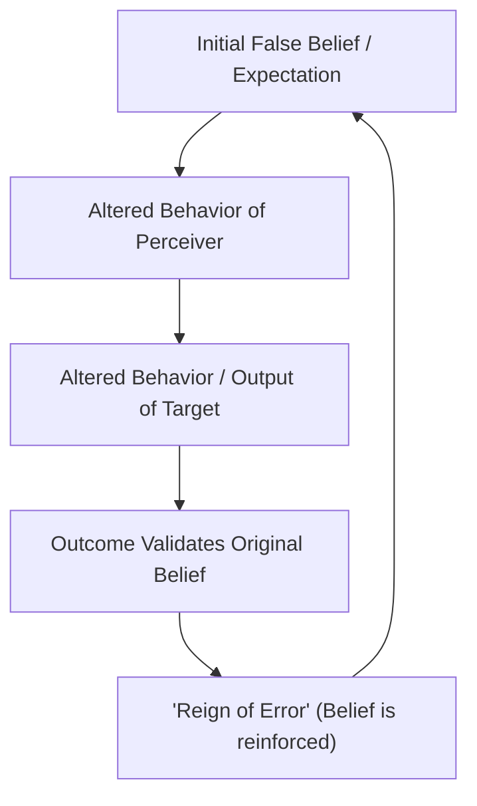

# Research: The Concept of Self-Fulfilling Prophecy

## Overview
Robert K. Merton's sociological framework for the self-fulfilling prophecy (1948) is the foundational concept that underlies the Pygmalion Effect.

## Definition
A self-fulfilling prophecy is a process whereby a belief or expectation, whether correct or incorrect, affects the outcome of a situation or the way a person or a group will behave. Specifically, as defined by sociologist Robert K. Merton in 1948, it begins with an initially false definition of the situation. This false belief evokes a new behavior that causes the original false conception to come true, thereby creating a "reign of error" where the observer believes their initial belief was verified by the facts.

## Historical and Theoretical Roots
- **The Thomas Theorem (1928):** W.I. Thomas and Dorothy Swaine Thomas formulated the theorem: "If men define situations as real, they are real in their consequences." Merton formalized this into the "self-fulfilling prophecy."
- **Robert K. Merton (1948):** Coined the term in his article "The Self-Fulfilling Prophecy" in *The Antioch Review*. He used the parable of a bank run (e.g., the fictional "Last National Bank") where depositors falsely believe the bank is going under, rush to withdraw their money, and cause the bank to collapse.

## Key Points
1. **The Initial False Definition**: The cycle starts with a false assumption, prediction, or expectation about a situation or individual (e.g., believing a solvent bank is insolvent or a student is incapable).
2. **Altered Behavioral Patterns**: Because individuals act as if the false belief is true, they modify their behavior (e.g., withdrawing money, or teachers withholding attention/resources).
3. **Actualization of the Prophecy**: The modified behavior creates actual conditions that force the original false belief to materialize in reality.
4. **The "Reign of Error" and Specious Validity**: The person who made the prediction sees the final outcome and concludes they were right all along, remaining blind to the fact that their own actions caused the outcome.
5. **Connection to the Pygmalion Effect**: The Pygmalion Effect is a specific, positive interpersonal application of Merton's framework, where high expectations of an authority figure (e.g., a teacher) lead to altered behaviors that cause a target (e.g., a student) to perform better.

## Wikilink Targets
- [[Mythological Origins of Pygmalion]]
- [[Rosenthal-Jacobson Classroom Study]]
- [[Behavioral Confirmation Processes]]
- [[Expectation Bias and Confirmation Bias]]
- [[The Golem Effect]]

## Cross-Domain Targets
- [[Sociology]]
- [[Philosophy of Mind]]

## Key Figures
- **Robert K. Merton**: American sociologist who formalized the self-fulfilling prophecy in 1948.
- **W.I. Thomas & Dorothy Swaine Thomas**: Formulated the Thomas Theorem in 1928, which served as the foundation for Merton's work.

## Sources
- https://simplypsychology.org/self-fulfilling-prophecy.html | Simply Psychology: Self-Fulfilling Prophecy | accessed 2026-07-12
- https://wikipedia.org/wiki/Self-fulfilling_prophecy | Wikipedia: Self-fulfilling prophecy | accessed 2026-07-12
- https://thedecisionlab.com/biases/self-fulfilling-prophecy | The Decision Lab: Self-Fulfilling Prophecy | accessed 2026-07-12
- https://antiochreview.org | Merton, R. K. (1948). The Self-Fulfilling Prophecy. Antioch Review, 8(2), 193-210 | accessed 2026-07-12

## Further Reading
- *The Self-Fulfilling Prophecy* by Robert K. Merton (1948) in *The Antioch Review*: The original paper coining and conceptualizing the term, demonstrating the sociological mechanisms using real-world and theoretical parables.
- *Social Theory and Social Structure* by Robert K. Merton (1949/1968): Contains the expanded context of the self-fulfilling prophecy within Merton's structural-functionalist perspective.
- *Pygmalion in the Classroom* by Robert Rosenthal and Lenore Jacobson (1968): The landmark study that empirically tested and popularized the Pygmalion effect as a classroom self-fulfilling prophecy.

## Diagram

