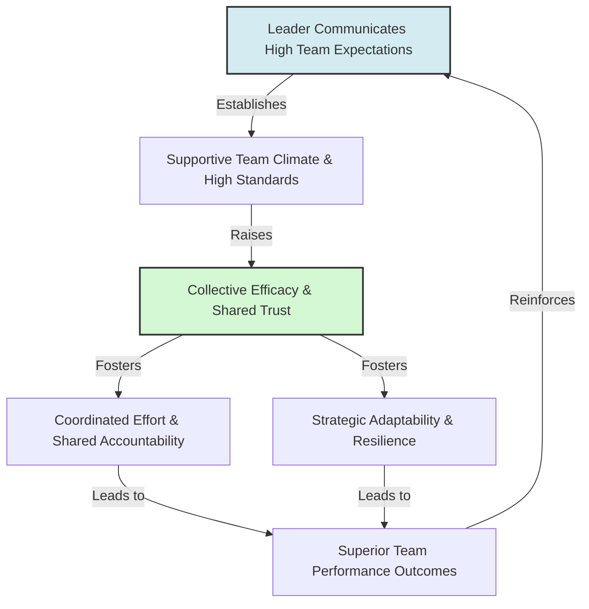

# Collective Efficacy and Team Pygmalion

> Collective Efficacy and Team Pygmalion describes how group-level expectations communicated by a leader shape a team's shared belief in its capability to execute tasks and achieve goals.

## Overview

While the Pygmalion Effect is typically analyzed as an individual, dyadic phenomenon (e.g., manager to employee), it also operates at the group level. A leader who communicates high expectations to an entire team raises the team's collective efficacy—their shared belief in their conjoint capabilities. This group-level Pygmalion effect alters team dynamics, fostering collaboration, trust, and shared commitment, which leads to superior group performance. It references the parent subtopic Pygmalion in Management & Organizations and the bucket [[applications-implications|Applications & Implications]] Map of Content (MOC).

## Key Points

- **Group-Level Expectancy**: A leader's high expectations are communicated to the group as a whole, establishing shared norms, high standards, and a supportive collective climate.
- **Collective Efficacy**: Formulated by Albert Bandura, collective efficacy is the group-level counterpart to self-efficacy. High collective efficacy drives teams to set challenging goals and coordinate efforts effectively.
- **Team Dynamics and Trust**: High collective expectations build team cohesion and mutual trust. Team members support one another, share workloads, and maintain high standards of accountability.
- **Resilience to Failure**: Teams with high collective efficacy are more resilient. When facing setbacks, they blame situational factors rather than capability, adapting their strategy and persisting.
- **Systemic Performance Gains**: Group-level Pygmalion effects produce systemic gains that exceed the sum of individual talents, proving that group beliefs shape team productivity.

## Diagram

## Connections

### Within The Pygmalion Effect
- [[livingston-pygmalion-in-management|Livingston Pygmalion in Management]] — The corporate application of individual expectation theory.
- [[leadership-styles-and-expectation-transmission|Leadership Styles and Expectation Transmission]] — How transformational leadership builds team confidence.
- [[the-galatea-effect|The Galatea Effect]] — The individual internalization of capability beliefs.
- [[the-golem-effect|The Golem Effect]] — The negative impact of group-level low expectations.
- [[rosenthal-climate-factor|Rosenthal Climate Factor]] — The team-level socioemotional climate created by the leader.

### Cross-Domain
- Organizational Behavior — Team cohesion, collective efficacy, and group performance.
- Sociology — Collective behavior, group norms, and social capital.

## Sources

- Albert Bandura (1997). *Self-efficacy: The exercise of control*. W. H. Freeman.
- Dov Eden (1990). *Pygmalion in Management*. Lexington Books.
- Stephen J. Zaccaro, et al. (1995). *Collective Efficacy*. Self-Efficacy, Adaptation, and Adjustment: Theory, Research, and Application.

## Further Reading

- *Self-efficacy: The exercise of control* by Albert Bandura (1997): Dedicated chapters explain the theory, measurement, and impact of collective efficacy in schools and business.
- *Pygmalion in Management* by Dov Eden (1990): Analyzes group-level expectancy experiments in military and corporate training groups.

---
*Part of [[the-pygmalion-effect-Index]] · [[applications-implications|Applications & Implications MOC]] · Pygmalion in Management & Organizations*