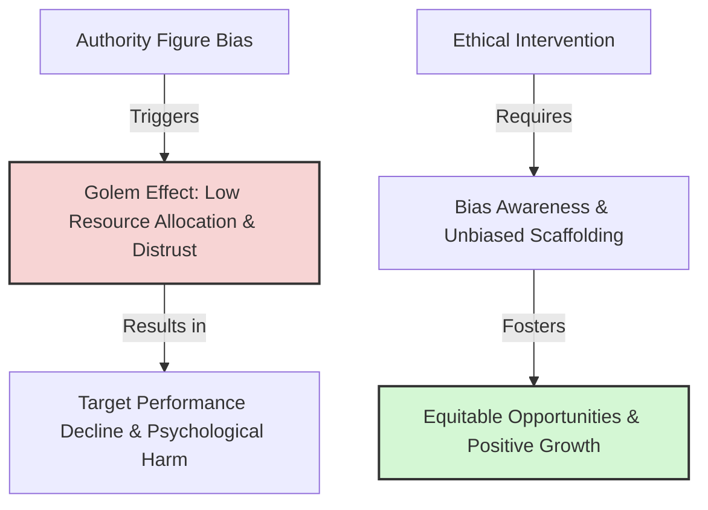

# Ethical Implications of Expectancy Effects

> Ethical Implications of Expectancy Effects describes the moral responsibilities and professional duties of authority figures to recognize, manage, and mitigate their expectations to prevent harm and distribute opportunity equitably.

## Overview

Because expectations function as self-fulfilling prophecies, authority figures like teachers, managers, and coaches wield significant power over the life trajectories of their subordinates. The Golem Effect demonstrates that holding low expectations can actively harm an individual's self-efficacy, academic achievement, or career progression. Consequently, there is an ethical imperative for professionals to identify their own unconscious biases, avoid discriminatory labeling, and consciously project supportive expectations. It references the parent subtopic Methodological Critiques and Ethical Considerations and the bucket [[applications-implications|Applications & Implications]] Map of Content (MOC).

## Key Points

- **The Power of Authority**: Subordinates internalize the expectations of authority figures, meaning leaders have a direct causal impact on subordinates' self-worth, performance, and health.
- **The Harm of the Golem Effect**: Unconsciously treating an individual as incapable or untrustworthy is not a neutral act; it actively restricts their resources (Input) and opportunities (Output), driving performance decline.
- **Mitigating Stereotypes**: Ethical practice requires leaders to identify and dismantle their own stereotypes based on race, gender, class, or physical appearance, which frequently drive expectation bias.
- **Equitable Distribution of Capital**: Managers and educators have a moral duty to distribute instruction, attention, and strategic opportunities equitably rather than concentrating them on favored "bloomers."
- **Institutional Accountability**: Organizations must design performance management and grading systems that control for expectancy bias, utilizing objective metrics and double-blind assessments where possible.

## Diagram

## Connections

### Within The Pygmalion Effect
- [[teacher-expectations-and-student-tracking|Teacher Expectations and Student Tracking]] — The moral challenges of educational streaming.
- [[livingston-pygmalion-in-management|Livingston Pygmalion in Management]] — The management duty to cultivate worker potential.
- [[the-golem-effect|The Golem Effect]] — The negative phenomenon that leaders are ethically bound to prevent.
- [[methodological-critiques-of-classroom-studies|Methodological Critiques of Classroom Studies]] — The need for rigor to avoid unvalidated labeling.
- [[pygmalion-in-sports-coaching|Pygmalion in Sports Coaching]] — The ethical role of coaches in distributing playtime and feedback.

### Cross-Domain
- Medicine & Bioethics — Medical ethics, clinician bias, and double-blind trial design.
- Sociology — Stereotype threat, systemic discrimination, and social justice.

## Sources

- Robert Rosenthal and Lenore Jacobson (1968). *Pygmalion in the Classroom*. Holt, Rinehart & Winston.
- Dov Eden (1990). *Pygmalion in Management*. Lexington Books.
- Simply Psychology: Pygmalion Effect — https://www.simplypsychology.org/pygmalion-effect.html

## Further Reading

- *Ethics in Education* by David Carr (2005): Discusses the moral duties of teachers regarding student expectation and labeling.
- *Unconscious Bias in the Workplace* (various organizational ethics reviews): Outlines practical strategies for managers to identify and mitigate Golem-style behaviors in corporate teams.

---
*Part of [[the-pygmalion-effect-Index]] · [[applications-implications|Applications & Implications MOC]] · Methodological Critiques and Ethical Considerations*