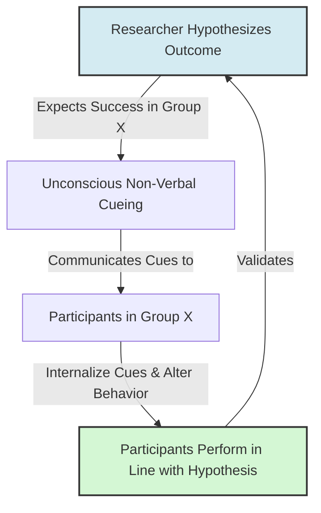

# Experimenter Expectancy Effect

> The Experimenter Expectancy Effect (or experimenter bias) is a psychological phenomenon where a researcher's cognitive bias and expectations about an experiment's outcome unconsciously influence the behavior of the participants, biasing the results.

## Overview

Discovered and popularized by Robert Rosenthal in the 1960s, the Experimenter Expectancy Effect represents a critical threat to scientific validity. Before conducting his classroom studies, Rosenthal demonstrated that researchers' hypotheses act as self-fulfilling prophecies in laboratory settings. When researchers expect a certain group of participants (or animals) to perform better, they unconsciously treat them differently, producing the very results they predicted. It references the parent subtopic Pygmalion in Medicine, Sports, and Research and the bucket [[applications-implications|Applications & Implications]] Map of Content (MOC).

## Key Points

- **Unconscious Transmission**: The transmission of expectations occurs through subtle, non-verbal cues (e.g., tone of voice, posture, facial expressions, and timing variations during test administration).
- **Animal Research Proof**: Rosenthal and Fode (1963) showed that students told their rats were "maze-bright" obtained significantly faster learning times than students told their rats were "maze-dull," despite the rats being genetically identical. The difference was traced to students handling "maze-bright" rats more gently and frequently.
- **Threat to Scientific Validity**: When researchers fail to control for expectancy effects, they may claim a treatment is effective when the results are actually due to their own behavioral cues.
- **Double-Blind Controls**: The primary scientific remedy is the double-blind trial, where neither the active experimenter nor the participant knows group assignments, blocking expectancy transmission.
- **Automation and Standardization**: Using recorded instructions, automated data logging, and blinded coding prevents the observer's expectations from introducing bias.

## Diagram

## Connections

### Within The Pygmalion Effect
- [[rosenthal-jacobson-classroom-study|Rosenthal-Jacobson Classroom Study]] — The educational extension of experimenter expectancy.
- [[expectation-bias-and-confirmation-bias|Expectation Bias and Confirmation Bias]] — The cognitive biases that create researcher expectations.
- [[placebo-and-nocebo-effects|Placebo and Nocebo Effects]] — The medical equivalents of researcher expectancy.
- [[behavioral-confirmation-processes|Behavioral Confirmation Processes]] — The active interpersonal alignment that realizes the bias.
- [[methodological-critiques-of-classroom-studies|Methodological Critiques of Classroom Studies]] — How experimenter bias critiques apply to early education research.

### Cross-Domain
- Medicine & Bioethics — Double-blind trials, medical ethics, and clinical trial design.
- Philosophy of Mind — Epistemology and the social construction of scientific facts.

## Sources

- Wikipedia: Observer-expectancy effect — https://en.wikipedia.org/wiki/Observer-expectancy_effect
- Robert Rosenthal and K. L. Fode (1963). *Three Experiments in Experimenter Bias*. Psychological Reports.
- The Decision Lab: Confirmation Bias — https://thedecisionlab.com/biases/confirmation-bias

## Further Reading

- *Experimentancy Effects in Behavioral Research* by Robert Rosenthal (1966): The definitive text compiling historical studies on experimenter bias in laboratories.
- *The Social Psychology of the Self-Fulfilling Prophecy* by Lee Jussim (1986): Reconciles scientific observer bias with interpersonal behavioral confirmation.

---
*Part of [[the-pygmalion-effect-Index]] · [[applications-implications|Applications & Implications MOC]] · Pygmalion in Medicine, Sports, and Research*