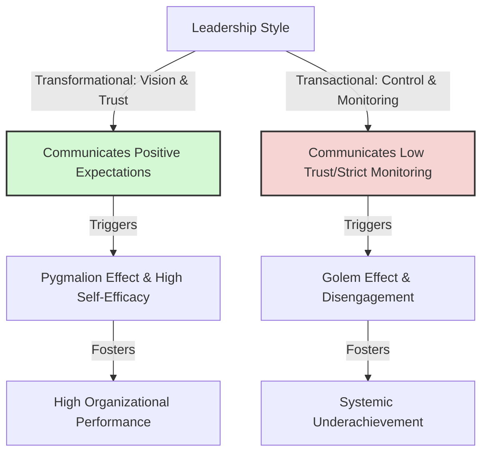

# Leadership Styles and Expectation Transmission

> Leadership Styles and Expectation Transmission describes how different leadership frameworks (such as transformational, transactional, and laissez-faire) communicate, establish, and enforce performance expectations in subordinates.

## Overview

A leader's expectation is not a static belief; it is actively transmitted through their leadership style. Research in organizational psychology shows that transformational leaders communicate high, positive expectations naturally, triggering the Pygmalion Effect and raising employee self-efficacy. Conversely, transactional and micmanaging leaders often communicate low trust and low expectations, triggering the Golem Effect and causing employee disengagement. It references the parent subtopic Pygmalion in Management & Organizations and the bucket [[applications-implications|Applications & Implications]] Map of Content (MOC).

## Key Points

- **Transformational Leadership**: Transformational leaders inspire subordinates by communicating an optimistic vision and high expectations. They demonstrate trust and respect, building self-efficacy and driving the Pygmalion Effect.
- **Transactional Leadership**: Transactional leaders focus on compliance and error correction. While they set clear expectations, their focus on mistakes can create an anxious climate and communicate doubt.
- **Laissez-Faire Leadership**: This hands-off style often communicates neglect or a lack of expectation, which employees can interpret as low value or disinterest, triggering the Golem Effect.
- **Micromanagement as Golem Signal**: Micromanagement communicates a lack of trust in an employee's capability, lowering their self-efficacy and causing them to withdraw effort.
- **Expectation Alignment**: High-expectation leadership requires alignment between verbal statements and non-verbal cues. If a leader says they expect success but micromanages, the employee reacts to the low-trust cues.

## Diagram

## Connections

### Within The Pygmalion Effect
- [[livingston-pygmalion-in-management|Livingston Pygmalion in Management]] — The foundational paper on manager expectations.
- [[collective-efficacy-and-team-pygmalion|Collective Efficacy and Team Pygmalion]] — How leadership styles shape group-level team expectations.
- [[rosenthal-climate-factor|Rosenthal Climate Factor]] — The warmth cues that characterize transformational leadership.
- [[the-galatea-effect|The Galatea Effect]] — How leadership trust builds employee self-belief.
- [[the-golem-effect|The Golem Effect]] — The negative consequence of low-trust, transactional leadership.

### Cross-Domain
- Organizational Behavior — Transformational leadership theory, employee motivation, and trust.
- Sociology — Role theory, organizational socialization, and power dynamics.

## Sources

- Bernard M. Bass (1985). *Leadership and Performance Beyond Expectations*. Free Press.
- Dov Eden (1990). *Pygmalion in Management*. Lexington Books.
- Simply Psychology: Leadership Styles — https://www.simplypsychology.org

## Further Reading

- *Leadership and Performance Beyond Expectations* by Bernard M. Bass (1985): The seminal text on transformational leadership and how leaders raise performance by raising expectations.
- *Pygmalion in Organizations* by Dov Eden (1992): Synthesizes experimental research on leadership expectations in military, educational, and business settings.

---
*Part of [[the-pygmalion-effect-Index]] · [[applications-implications|Applications & Implications MOC]] · Pygmalion in Management & Organizations*