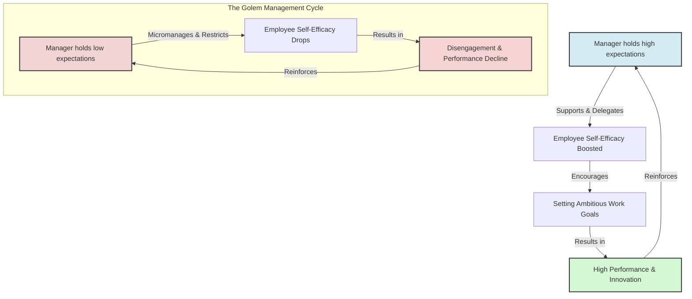

# Livingston Pygmalion in Management

> Livingston Pygmalion in Management describes J. Sterling Livingston's seminal application of teacher-expectancy effects to business organizations, showing that manager expectations dictate employee performance.

## Overview

In his classic 1969 *Harvard Business Review* article, "Pygmalion in Management," J. Sterling Livingston argued that a manager's expectations are the single most important factor in a subordinate's development and career growth. If a manager holds high expectations, they treat employees in a way that fosters high self-efficacy (the Galatea effect), resulting in productivity gains. Conversely, low expectations (the Golem effect) lead to disengagement, underperformance, and organizational decline. It references the parent subtopic Pygmalion in Management & Organizations and the bucket [[applications-implications|Applications & Implications]] Map of Content (MOC).

## Key Points

- **The Power of Expectations**: Subordinates generally perform in accordance with their manager's expectations. High expectations catalyze high achievement; low expectations trigger poor performance.
- **The Critical First Year**: A manager's expectations during an employee's first year are highly predictive of their long-term career trajectory. Early positive experiences build enduring self-efficacy.
- **Expectation Authenticity**: Expectations cannot be faked. Subordinates easily detect insincerity in positive feedback if the manager's underlying, non-verbal cues communicate doubt (Climate factor).
- **The Cost of Low Expectations**: Managers who hold low expectations communicate their beliefs through micromanagement, critical feedback, and assignment of simple tasks, causing employees to withdraw effort.
- **Developing High-Expectation Leaders**: Livingston emphasized that organizations must train managers to hold and communicate positive, high expectations, transforming self-fulfilling prophecies into a tool for business success.

## Diagram

## Connections

### Within The Pygmalion Effect
- [[the-concept-of-self-fulfilling-prophecy|The Concept of Self-Fulfilling Prophecy]] — The core sociological mechanism adapted to corporate environments.
- [[leadership-styles-and-expectation-transmission|Leadership Styles and Expectation Transmission]] — The specific styles that communicate manager expectations.
- [[collective-efficacy-and-team-pygmalion|Collective Efficacy and Team Pygmalion]] — The group-level manifestation of positive expectations.
- [[the-galatea-effect|The Galatea Effect]] — How employees internalize manager expectations into self-beliefs.
- [[the-golem-effect|The Golem Effect]] — The negative organizational cost of low manager expectations.

### Cross-Domain
- Organizational Behavior — Leadership, performance management, and employee engagement.
- Sociology — Structural roles, professional identities, and mentoring.

## Sources

- J. Sterling Livingston (1969). *Pygmalion in Management*. Harvard Business Review.
- Dov Eden (1990). *Pygmalion in Management*. Lexington Books.
- Foxwood Associates: Pygmalion in Management — https://foxwoodassociates.com

## Further Reading

- *Pygmalion in Management* by J. Sterling Livingston (1969 HBR article, reprinted 2003): The foundational business paper outlining the manager expectancy model.
- *Pygmalion in Organizations: Expectations, the self-fulfilling prophecy, and approaches to administration* by Dov Eden (1992): A comprehensive academic text detailing organizational expectancy experiments.

---
*Part of [[the-pygmalion-effect-Index]] · [[applications-implications|Applications & Implications MOC]] · Pygmalion in Management & Organizations*