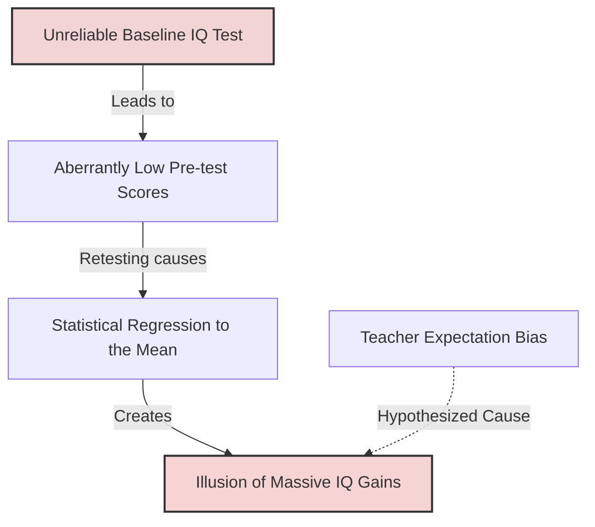

# Methodological Critiques of Classroom Studies

> Methodological Critiques of Classroom Studies describes the scientific debates, replication failures, and psychometric limitations that challenged the validity of early Pygmalion research in education.

## Overview

Following the publication of *Pygmalion in the Classroom* in 1968, the educational psychology community was divided. While the concept of teacher expectations altering student intelligence was highly popular, psychometricians and researchers conducted thorough audits of the study's design. They revealed significant flaws, including unreliable pre-test measures in young children, regression to the mean, high attrition rates, and inconsistencies in data reporting, which cast doubt on the strength and universality of the effect. It references the parent subtopic Methodological Critiques and Ethical Considerations and the bucket [[applications-implications|Applications & Implications]] Map of Content (MOC).

## Key Points

- **Unreliable Pre-Test Baseline**: Robert Thorndike pointed out that the TOGA intelligence test used was highly unsuitable for first and second graders. Pre-test scores in some classes were impossibly low (in the range of intellectual disability), indicating that young children were simply confused by the test.
- **Regression to the Mean**: Because the pre-test baselines were aberrantly low due to test confusion, post-test scores naturally moved back toward the average (regression to the mean) on retesting, creating a statistical illusion of cognitive "blooming" that was unrelated to teacher expectation.
- **High Attrition Rates**: Richard Snow critiqued the high percentage of students who were not retested, arguing that selective attrition could bias the final sample and artificially inflate the reported effect size.
- **Inability to Recall Labels**: Independent audits showed that many teachers could not recall which of their students had been labeled as "intellectual bloomers," suggesting that the experimental manipulation was not as strong as claimed.
- **Replication Failures**: Subsequent attempts to replicate the classroom Pygmalion study in other schools often yielded small, inconsistent, or non-significant effects, leading researchers to conclude that teacher expectancy is a complex, context-dependent factor rather than a universal rule.

## Diagram

## Connections

### Within The Pygmalion Effect
- [[rosenthal-jacobson-classroom-study|Rosenthal-Jacobson Classroom Study]] — The target study that faced these methodological critiques.
- [[teacher-expectations-and-student-tracking|Teacher Expectations and Student Tracking]] — The educational system practices that critiques must account for.
- [[experimenter-expectancy-effect|Experimenter Expectancy Effect]] — The researcher bias that may have colored early data analysis.
- [[expectation-bias-and-confirmation-bias|Expectation Bias and Confirmation Bias]] — The cognitive biases that critics accuse the original researchers of having.
- [[ethical-implications-of-expectancy-effects|Ethical Implications of Expectancy Effects]] — How research methodology affects the ethical application of social science.

### Cross-Domain
- Sociology — Scientific paradigms, replication crises, and research methodology.
- Medicine & Bioethics — Validity of psychological testing and clinical trial controls.

## Sources

- Robert L. Thorndike (1968). *Review of Pygmalion in the Classroom*. Educational Research Journal.
- Richard E. Snow (1969). *Unfinished Pygmalion*. Contemporary Psychology.
- J. D. Elashoff and Richard E. Snow (1971). *Pygmalion Reconsidered*. Charles A. Jones Publishing.

## Further Reading

- *Pygmalion Reconsidered* by J. D. Elashoff and Richard E. Snow (1971): The most comprehensive critique and re-analysis of the original Oak School data.
- *Review of Pygmalion in the Classroom* by Robert L. Thorndike (1968): The foundational psychometric critique explaining the test validity issues in the study.

---
*Part of [[the-pygmalion-effect-Index]] · [[applications-implications|Applications & Implications MOC]] · Methodological Critiques and Ethical Considerations*