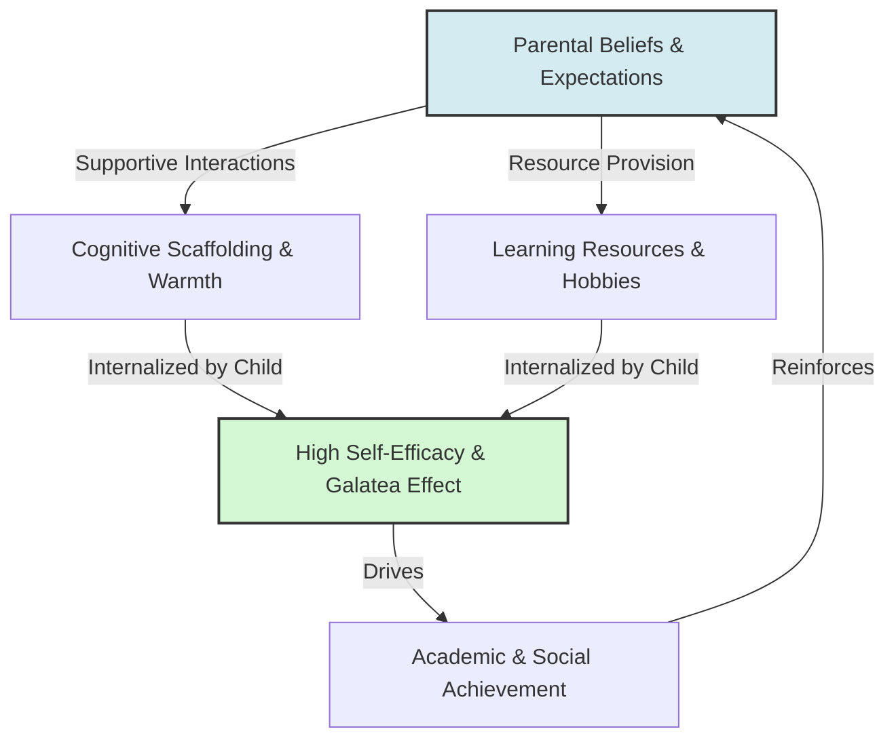

# Parental Expectations and Child Outcomes

> Parental Expectations and Child Outcomes describes the long-term developmental impact of parents' beliefs about their children's cognitive abilities, personality traits, and future educational success.

## Overview

While the Pygmalion Effect is primarily studied in institutional settings like classrooms and workplaces, it operates extensively in the home. Parental expectations act as a powerful developmental catalyst, forming a child's early self-concept and self-efficacy. When parents believe in their children's potential and hold high educational aspirations, they communicate this through supportive behaviors and resource allocation, raising the child's own self-expectations (Galatea effect). It references the parent subtopic Pygmalion in Education and Child Development and the bucket [[applications-implications|Applications & Implications]] Map of Content (MOC).

## Key Points

- **Communication Channels**: Parents communicate expectations through non-verbal warmth, verbal encouragement, task scaffolding, and the provision of cognitive resources (books, hobbies, tutoring).
- **Internalization of Self-Concept**: Children construct their looking-glass self based on parental appraisals. High parental expectations build strong self-efficacy and resilience, while low expectations trigger self-doubt.
- **Socioeconomic Confounders**: Parental expectations are highly correlated with family socioeconomic status. Wealthier parents typically expect higher educational attainment and have the capital to enforce those expectations, perpetuating structural advantages.
- **Developmental Scaffolding**: High expectations encourage parents to scaffold tasks—providing support that allows the child to tackle slightly more difficult challenges than they could manage alone, accelerating cognitive growth.
- **The Burden of Perfection**: Extremely high, rigid parental expectations can backfire, causing anxiety, depression, and fear of failure, showing that expectations must be realistic and support-based to be beneficial.

## Diagram

## Connections

### Within The Pygmalion Effect
- [[teacher-expectations-and-student-tracking|Teacher Expectations and Student Tracking]] — The counterpart educational system that details school expectancy.
- [[rosenthal-jacobson-classroom-study|Rosenthal-Jacobson Classroom Study]] — The foundational experiment demonstrating expectancy effects.
- [[the-galatea-effect|The Galatea Effect]] — How children internalize parental expectations into self-beliefs.
- [[the-golem-effect|The Golem Effect]] — The negative impact of low parental expectations.
- [[labeling-theory-and-social-identity|Labeling Theory and Social Identity]] — The internalization of early developmental labels in the family.

### Cross-Domain
- Sociology — Family sociology, social stratification, and cultural reproduction.
- Neurobiology — Early stress response systems and brain development.

## Sources

- Pamela E. Davis-Kean (2005). *The Influence of Parent Education and Family Income on Child's Achievement: The Indirect Role of Parental Expectations and the Home Environment*. Journal of Family Psychology.
- W. Andrew Collins, et al. (2000). *Contemporary Research on Parenting: The Case for Nature and Nurture*. American Psychologist.
- Simply Psychology: Pygmalion Effect — https://www.simplypsychology.org/pygmalion-effect.html

## Further Reading

- *The Power of Expectations* (various developmental psychology reviews): Examines how home and school expectations interact to predict academic trajectories.
- *Mindset: The New Psychology of Success* by Carol S. Dweck (2006): Focuses on parent-child praise dynamics and their impact on academic motivation.

---
*Part of [[the-pygmalion-effect-Index]] · [[applications-implications|Applications & Implications MOC]] · Pygmalion in Education and Child Development*