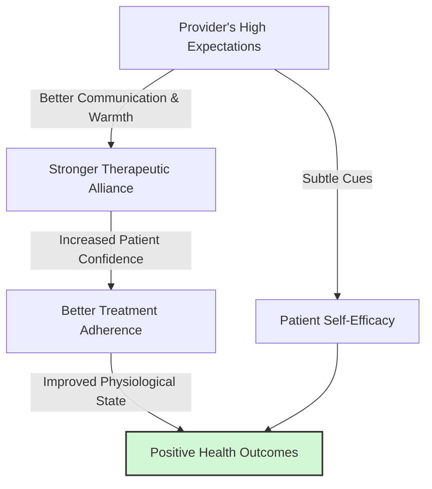

# Pygmalion in Healthcare

> The Pygmalion Effect in healthcare refers to how a healthcare provider's expectations of a patient's prognosis or adherence can significantly influence the patient's actual medical outcomes and recovery behaviors.

## Overview

In the medical setting, expectations held by physicians, nurses, and therapists transmit subtly to patients through tone of voice, body language, and the amount of time spent explaining treatments. When providers harbor high expectations for a patient's recovery, they tend to provide more supportive care and clearer communication. This fosters greater patient trust, better adherence to treatment protocols, and improved health outcomes. It closely relates to the parent subtopic Pygmalion in Medicine, Sports, and Research and the bucket [[applications-implications|Applications & Implications]] Map of Content (MOC).

## Key Points

- **Provider-Patient Communication**: High expectations from providers lead to warmer, more empathetic communication, which increases a patient's confidence in their treatment.
- **Treatment Adherence**: Patients who sense their doctor believes in their recovery are more likely to comply with rigorous medication schedules and lifestyle changes.
- **Diagnostic Overshadowing**: Negative expectations (the Golem effect) can cause providers to under-treat or dismiss symptoms, especially in marginalized demographics, worsening health outcomes.
- **Non-Verbal Cues**: Much of the expectancy transmission in healthcare occurs non-verbally; doctors may unknowingly spend less time or maintain less eye contact with patients they unconsciously deem less likely to recover.
- **Therapeutic Alliance**: A strong belief in a positive outcome strengthens the therapeutic alliance, functioning as a psychological catalyst for healing alongside pharmacological treatments.

## Diagram

## Connections

### Within The Pygmalion Effect
- [[placebo-and-nocebo-effects|Placebo and Nocebo Effects]] — The biological and psychological counterpart of provider expectations on patient healing.
- [[the-galatea-effect|The Galatea Effect]] — How a patient's self-expectations complement the provider's expectations.
- [[neurobiological-mediators-of-expectation|Neurobiological Mediators of Expectation]] — The brain pathways that turn clinical confidence into physical healing.
- [[ethical-implications-of-expectancy-effects|Ethical Implications of Expectancy Effects]] — The moral duty of providers to maintain positive expectations for all patients.
- [[the-golem-effect|The Golem Effect]] — The dangerous consequences when healthcare providers hold negative expectations about a patient's recovery.

### Cross-Domain
- Healthcare Communication — The study of how doctors and patients interact and transmit information.
- Medical Ethics — Principles governing provider behavior and unbiased treatment of patients.

## Sources

- Pubmed: The Pygmalion Effect in Medical Education and Practice — https://pubmed.ncbi.nlm.nih.gov/30453123/
- NCBI: Expectancy Effects in Clinical Medicine — https://www.ncbi.nlm.nih.gov/pmc/articles/PMC4161962/
- Journal of Public Health: Provider expectations and patient outcomes — https://academic.oup.com/jpubhealth/article/30/2/149/1572097

## Further Reading

- *Compassionomics: The Revolutionary Scientific Evidence that Caring Makes a Difference* by Stephen Trzeciak (2019) — Explores how provider empathy and expectations improve clinical outcomes.
- *The Patient's Brain: The neuroscience behind the doctor-patient relationship* by Fabrizio Benedetti (2010) — Examines how the therapeutic encounter itself acts as a powerful medical intervention.

---
*Part of [[the-pygmalion-effect-Index]] · [[applications-implications|Applications & Implications MOC]] · Pygmalion in Medicine, Sports, and Research*
