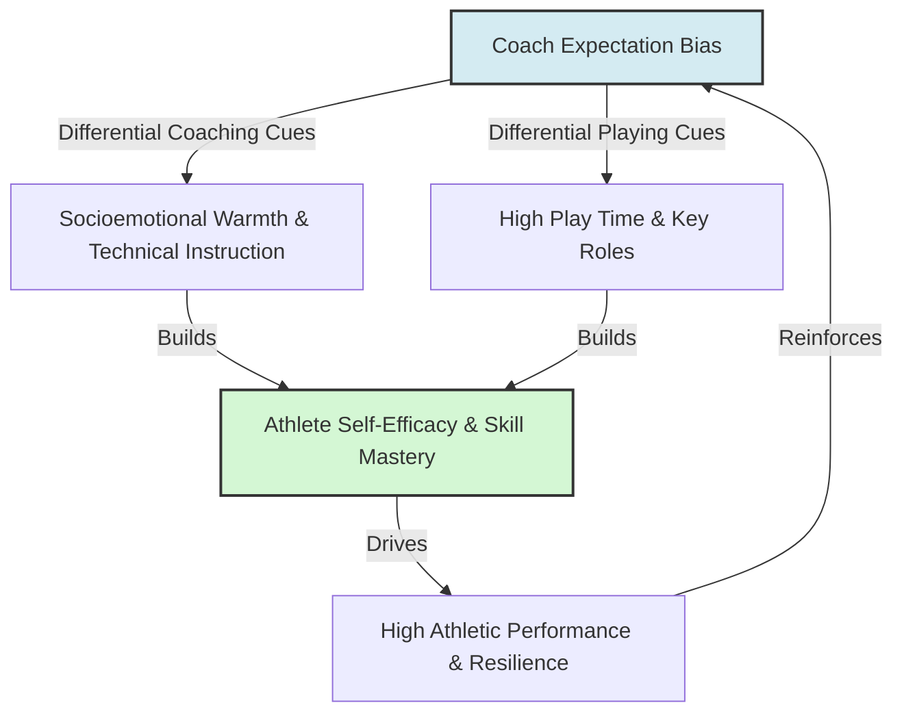

# Pygmalion in Sports Coaching

> Pygmalion in Sports Coaching describes the psychological process where a coach's initial expectations about an athlete's physical talent and potential determine the quality of coaching, feedback, and play opportunities the athlete receives, shaping their performance.

## Overview

In athletic training, coaches form quick judgements about athletes based on physical build, early performance, or reputation. Research in sports psychology shows that these judgements establish expectancy loops. High-expectation athletes receive warmer socioemotional treatment (Climate), denser skill instruction (Input), more play time (Output), and constructive coaching (Feedback). Low-expectation athletes receive repetitive drills and destructive criticism, triggering the Golem Effect and causing performance decline. It references the parent subtopic Pygmalion in Medicine, Sports, and Research and the bucket [[applications-implications|Applications & Implications]] Map of Content (MOC).

## Key Points

- **Judgment Speed**: Coaches often form stable expectations of athletes' capabilities within the first few days of practice, based on stereotypes or superficial physical traits.
- **Instructional Bias (Input)**: Coaches spend more time teaching advanced skills and strategies to athletes they expect to excel, while giving low-expectation athletes simple, repetitive tasks.
- **Play Opportunity (Output)**: High-expectation athletes receive more play time in games and are given critical, high-pressure roles, allowing them to gain competitive experience.
- **Constructive Feedback**: Errors made by favored athletes are corrected with detailed, technical guidance. Errors made by low-expectation athletes are met with frustration, signaling that failure is expected.
- **Internalization of Self-Efficacy**: Athletes internalize their coach's appraisal, which raises or lowers their own self-efficacy (Galatea effect) and directly impacts their athletic persistence and anxiety levels.

## Diagram

## Connections

### Within The Pygmalion Effect
- [[livingston-pygmalion-in-management|Livingston Pygmalion in Management]] — The corporate application of leadership expectancy.
- [[the-galatea-effect|The Galatea Effect]] — How athletes internalize coaching belief into self-efficacy.
- [[the-golem-effect|The Golem Effect]] — The negative impact of low coaching expectations.
- [[rosenthal-climate-factor|Rosenthal Climate Factor]] — The verbal and non-verbal warmth communicating coaching trust.
- [[ethical-implications-of-expectancy-effects|Ethical Implications of Expectancy Effects]] — The ethical obligation of coaches to distribute instruction equitably.

### Cross-Domain
- Organizational Behavior — Performance management, bias in talent identification, and mentoring.
- Sociology — Stereotype threat, physical culture, and meritocracy in sports.

## Sources

- Thelma S. Horn (1984). *Expectancy Effects in the Context of Athletic Coaching*. Journal of Sport Psychology.
- Dov Eden (1990). *Pygmalion in Management*. Lexington Books.
- Simply Psychology: Pygmalion Effect — https://www.simplypsychology.org/pygmalion-effect.html

## Further Reading

- *Coaching Education: The Expectation-Performance Process* (sports science reviews): Details the specific verbal and non-verbal interactions that differentiate high- and low-expectation coaches.
- *Self-Efficacy and Sports Performance* (athletic training literature): Explores the relationship between coach feedback, self-efficacy, and athletic achievement.

---
*Part of [[the-pygmalion-effect-Index]] · [[applications-implications|Applications & Implications MOC]] · Pygmalion in Medicine, Sports, and Research*