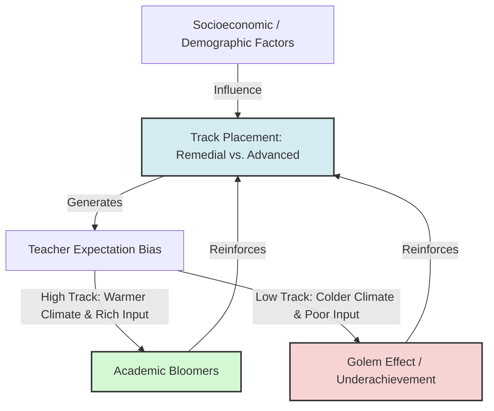

# Teacher Expectations and Student Tracking

> Teacher Expectations and Student Tracking describes the institutional practice of grouping students by perceived academic ability and the self-fulfilling educational consequences that follow.

## Overview

In educational systems, tracking (or streaming) is a widespread practice designed to tailor instruction to student needs. However, educational sociologists have shown that tracking often acts as a structural vehicle for expectation transmission. When students are assigned to lower-ability tracks, teachers hold lower expectations for their intellectual capacity. This triggers the Golem Effect, leading to reduced instruction quality (Input), fewer opportunities (Output), and institutionalized underachievement. It references the parent subtopic Pygmalion in Education and Child Development and the bucket [[applications-implications|Applications & Implications]] Map of Content (MOC).

## Key Points

- **Institutional Labeling**: Placing a student in a specific academic track (e.g., "remedial," "regular," or "advanced") acts as an official label that shapes teachers' and parents' expectations.
- **Watered-Down Input**: Teachers assigned to lower tracks tend to present simpler material, assign repetitive drills, and avoid challenging assignments, restricting students' opportunity to learn.
- **Stereotype Threat and Internalization**: Students in lower tracks internalize their group's low status, which lowers their academic self-concept and self-efficacy, making them less willing to put in effort.
- **Peer Group Reinforcement**: Tracking groups low-performing or disengaged students together, creating a classroom culture that reinforces anti-academic norms and reduces positive peer modeling.
- **Sociodemographic Bias**: Research consistently shows that minority and low-income students are disproportionately placed in lower tracks, even when their objective scores match those of wealthier peers, compounding systemic inequalities.

## Diagram

## Connections

### Within The Pygmalion Effect
- [[rosenthal-jacobson-classroom-study|Rosenthal-Jacobson Classroom Study]] — The foundational experiment demonstrating teacher expectation effects.
- [[parental-expectations-and-child-outcomes|Parental Expectations and Child Outcomes]] — How home expectations interact with school tracking.
- [[the-golem-effect|The Golem Effect]] — The negative consequence of low-track grouping.
- [[labeling-theory-and-social-identity|Labeling Theory and Social Identity]] — The sociological process of internalizing track labels.
- [[ethical-implications-of-expectancy-effects|Ethical Implications of Expectancy Effects]] — The moral responsibilities of educators in tracking systems.

### Cross-Domain
- Sociology — Educational sociology, social stratification, and systemic bias.
- Organizational Behavior — Performance management and selection bias.

## Sources

- Wikipedia: Tracking (education) — https://en.wikipedia.org/wiki/Tracking_(education)
- Jeannie Oakes (1985). *Keeping Track: How Schools Structure Inequality*. Yale University Press.
- Simply Psychology: Pygmalion Effect In The Classroom — https://www.simplypsychology.org/pygmalion-effect.html

## Further Reading

- *Keeping Track: How Schools Structure Inequality* by Jeannie Oakes (2005 second edition): The seminal text analyzing the negative social and academic consequences of tracking in secondary education.
- *Teacher Expectations and Pupil Learning* by Thomas L. Good (1987): Details the specific instructional behaviors that differentiate high- and low-expectation classrooms.

---
*Part of [[the-pygmalion-effect-Index]] · [[applications-implications|Applications & Implications MOC]] · Pygmalion in Education and Child Development*