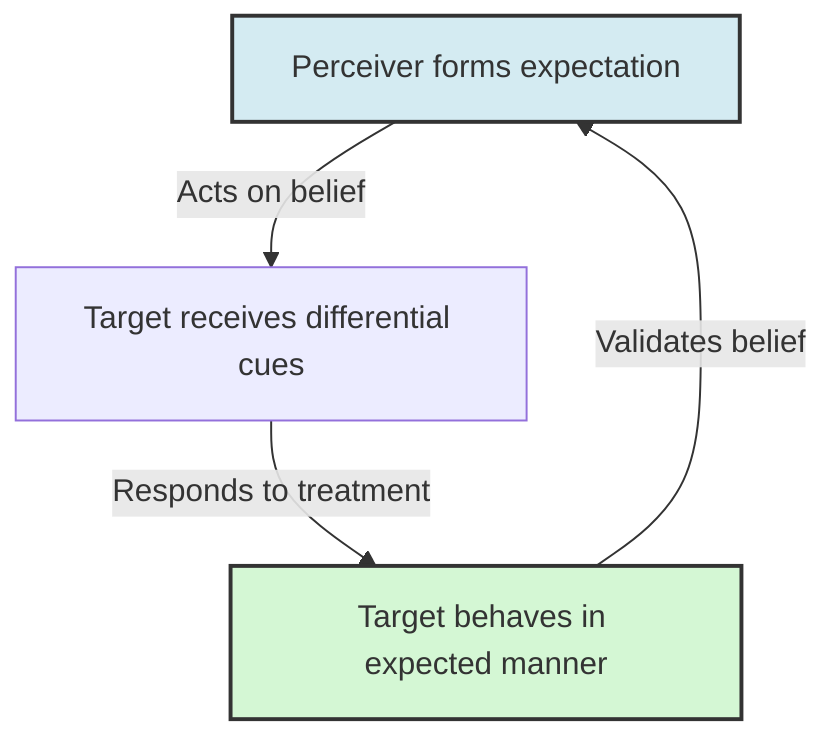

# Behavioral Confirmation Processes

> Behavioral confirmation is a social psychological phenomenon where a perceiver’s expectations about a target person lead the perceiver to behave in ways that cause the target to confirm those expectations.

## Overview

Extensively developed by social psychologist Mark Snyder, behavioral confirmation is the primary transactional mechanism of the self-fulfilling prophecy in face-to-face interaction. The process highlights how subjective beliefs and stereotypes are translated into objective reality through behavioral alignment, effectively creating the very evidence the perceiver uses to validate their expectations. It references the parent subtopic Core Cognitive & Social Psychology Concepts and the bucket [[foundations|Foundations]] Map of Content (MOC).

## Key Points

- **The Behavioral Bridge**: While general self-fulfilling prophecies describe any outcome matching a belief, behavioral confirmation specifically focuses on how one person's behavior actively shapes the behavior of another in social interaction.
- **The Role of the Perceiver**: The perceiver forms an initial expectation or stereotype (e.g., physical attractiveness, intelligence, or hostility) and adapts their communication style (climate, feedback, input) accordingly.
- **The Target's Response**: The target, unaware of the perceiver's expectations, responds to the perceiver's specific behaviors. In doing so, they align their own actions with those behavioral cues (e.g., being warm when treated warmly).
- **The Classic 1977 Snyder Study**: Snyder, Tanke, and Berscheid demonstrated that men who believed they were talking on the phone to an attractive woman behaved more warmly, which caused the women to respond in a more sociable, friendly manner, confirming the initial stereotype.
- **Reinforcement and Validation**: The perceiver interprets the target's behavior as objective validation of their initial belief, ignoring their own causal role in eliciting it.

## Diagram

## Connections

### Within The Pygmalion Effect
- [[the-concept-of-self-fulfilling-prophecy|The Concept of Self-Fulfilling Prophecy]] — The sociological foundation for expectations driving outcomes.
- [[expectation-bias-and-confirmation-bias|Expectation Bias and Confirmation Bias]] — The cognitive filters that shape the perceiver's initial expectation.
- [[labeling-theory-and-social-identity|Labeling Theory and Social Identity]] — How external labels are internalized by the target.
- [[rosenthal-climate-factor|Rosenthal Climate Factor]] — The emotional warmth communication channel that cues the target.
- [[teacher-expectations-and-student-tracking|Teacher Expectations and Student Tracking]] — The manifestation of behavioral confirmation in classrooms.

### Cross-Domain
- Sociology — Structural expectations and role modeling.
- Philosophy of Mind — Interpersonal constructs and mind-reading.

## Sources

- Wikipedia: Behavioral confirmation — https://en.wikipedia.org/wiki/Behavioral_confirmation
- Mark Snyder, Elizabeth Decker Tanke, and Ellen Berscheid (1977). *Social perception and interpersonal behavior: On the self-fulfilling nature of social stereotypes*. Journal of Personality and Social Psychology.
- Lee Jussim (1986). *Self-Fulfilling Prophecies: A Theoretical and Integrative Review*. Psychological Review.

## Further Reading

- *Social perception and interpersonal behavior: On the self-fulfilling nature of social stereotypes* (Snyder, Tanke, & Berscheid, 1977): The classic empirical demonstration of behavioral confirmation in telephone conversations.
- *Self-Fulfilling Prophecies: A Theoretical and Integrative Review* (Lee Jussim, 1986): A key text reconciling behavioral confirmation and cognitive biases in interpersonal relations.

---
*Part of [[the-pygmalion-effect-Index]] · [[foundations|Foundations MOC]] · Core Cognitive & Social Psychology Concepts*