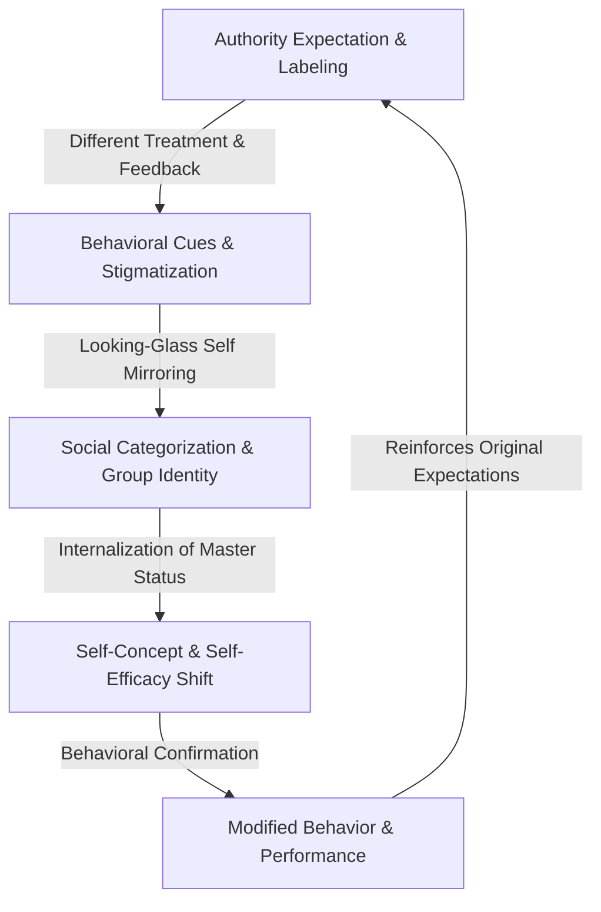

# Labeling Theory and Social Identity

> Labeling Theory and Social Identity describe how external categorization by authority figures functions as cognitive expectations that individuals internalize, directly modifying their self-concept and driving behavioral confirmation.

## Overview

This synthesis integrates sociological labeling theory (which studies how society categorizes individuals) with social identity theory (which studies how individuals group themselves and construct self-concept). Together, they explain how positive expectations (the Pygmalion Effect) or negative expectations (the Golem Effect) are internalized by the target, shifting their self-efficacy and driving them to conform to the label. It references the parent subtopic Core Cognitive & Social Psychology Concepts and the bucket [[foundations|Foundations]] Map of Content (MOC).

## Key Points

- **Social Construction of Reality**: Labels are social categories constructed by authoritative "moral entrepreneurs." Once a label is applied, it shapes how others interact with the individual and defines the boundaries of their social environment.
- **Primary vs. Secondary Deviance**: Edwin Lemert's distinction shows that initial actions (primary deviance) do not define an individual, but negative societal reactions and labeling create a "master status." The individual then adapts by internalizing this label, resulting in secondary deviance where their subsequent behavior conforms to the label.
- **Social Categorization and Group Identity**: According to Henri Tajfel's Social Identity Theory, individuals cognitively group themselves and others to navigate the social world. When labeled, individuals are categorized into in-groups or out-groups, which dictates their self-evaluation and leads them to adopt group-typical norms and behaviors.
- **Looking-Glass Self Internalization**: Charles Horton Cooley's concept of the "looking-glass self" serves as the psychological bridge for internalization. Individuals construct their self-concept by imagining how others perceive and judge them, meaning positive labels (Pygmalion effect) or negative labels (Golem effect) directly modify their self-efficacy.
- **Behavioral Confirmation Loops**: Once a label becomes a salient part of an individual's social identity, a behavioral confirmation process occurs. The individual acts in accordance with their internalized expectations, which in turn reinforces the authority figure's original label, completing the self-fulfilling loop.

## Diagram

## Connections

### Within The Pygmalion Effect
- [[the-concept-of-self-fulfilling-prophecy|The Concept of Self-Fulfilling Prophecy]] — The sociological foundation for labels becoming reality.
- [[behavioral-confirmation-processes|Behavioral Confirmation Processes]] — The face-to-face interactions that validate labeled expectations.
- [[teacher-expectations-and-student-tracking|Teacher Expectations and Student Tracking]] — The primary systemic application of labeling in schools.
- [[the-golem-effect|The Golem Effect]] — The negative impact of low-performance labeling.
- [[expectation-bias-and-confirmation-bias|Expectation Bias and Confirmation Bias]] — The cognitive biases that create and maintain labels.

### Cross-Domain
- Sociology — Merton's self-fulfilling prophecy and institutionalized labeling.
- Philosophy of Mind — Belief-desire psychology and constructed reality.

## Sources

- Simply Psychology: Social Identity Theory — https://www.simplypsychology.org/social-identity-theory.html
- Simply Psychology: Labeling Theory In Sociology and Psychology — https://www.simplypsychology.org/labeling-theory.html
- Britannica: Labeling Theory — https://www.britannica.com/topic/labeling-theory

## Further Reading

- *Outsiders: Studies in the Sociology of Deviance* by Howard S. Becker (1963): Foundational text explaining how social rules and reactions construct deviance and enforce outsider identities.
- *Social Pathology* by Edwin M. Lemert (1951): Introduces primary and secondary deviance, explaining the development of internalized labeling.
- "Social perception and interpersonal behavior: On the self-fulfilling nature of social stereotypes" by Snyder, M., Tanke, E. D., & Berscheid, E. (1977): Empirical study demonstrating how social expectations trigger actual behavioral confirmation.

---
*Part of [[the-pygmalion-effect-Index]] · [[foundations|Foundations MOC]] · Core Cognitive & Social Psychology Concepts*