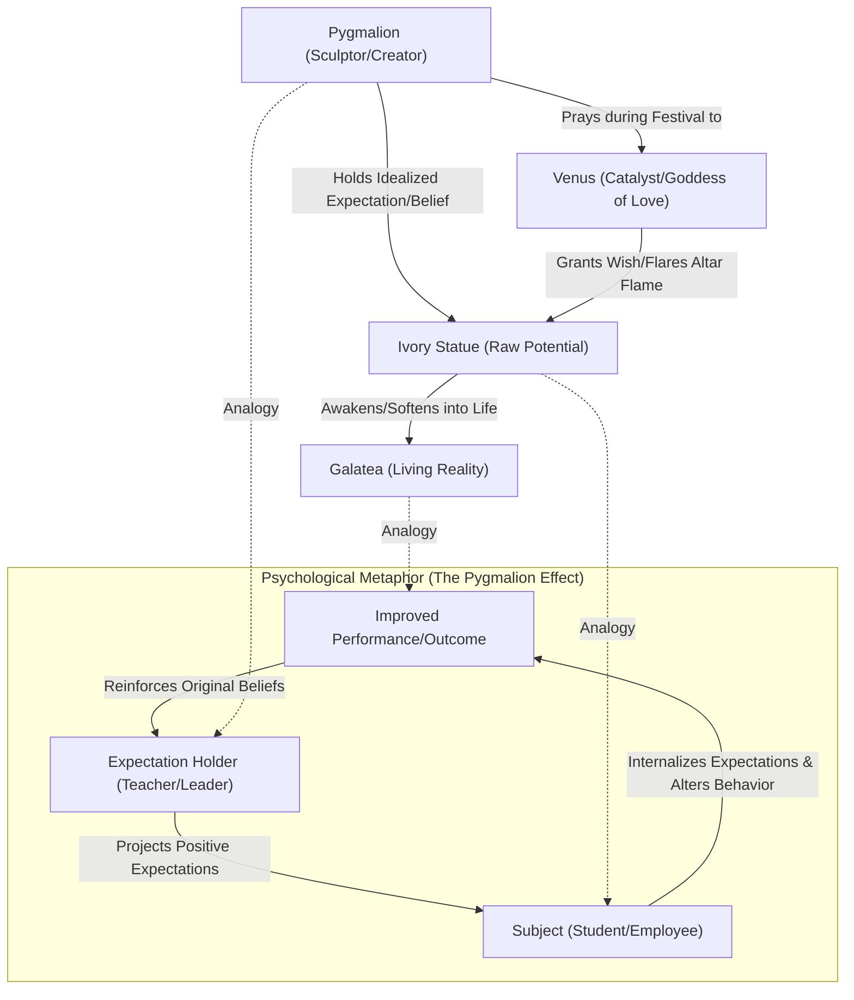

# Mythological Origins of Pygmalion

> The mythological origin of the Pygmalion effect stems from Ovid's narrative of a sculptor who creates a perfect statue, falls in love with it, and witnesses it come to life through divine intervention.

## Overview

The Pygmalion effect takes its name from Book X of Ovid's classical Latin poem *Metamorphoses*. The myth describes Pygmalion, a Cypriot sculptor who, disillusioned by local women, carves a flawless ivory statue of a woman. His intense belief, desire, and care for this inanimate object eventually lead to it being animated by the goddess Venus. In modern social science, this narrative serves as the foundational metaphor for how expectations can shape reality, turning a subjective projection into a tangible outcome. It references the parent subtopic Historical and Mythological Roots and the bucket [[foundations|Foundations]] Map of Content (MOC).

## Key Points

- **Ovid's Literary Source**: In Book X of Ovid's *Metamorphoses*, Pygmalion is depicted as a Cypriot sculptor who rejects real women due to their perceived flaws, devoting himself instead to carving an ivory statue of unparalleled beauty.
- **Venus's Divine Intervention**: During the festival of Venus, Pygmalion prays to the goddess for a bride resembling his ivory creation. Touched by his devotion, Venus signals her favor by causing the altar flames to leap three times; upon his return home, the statue softens and awakens under his touch.
- **The Psychology of Self-Fulfilling Prophecy**: The myth serves as the primary metaphorical foundation for the Pygmalion Effect, where high expectations drive behaviors that bring those expectations to fruition. Just as Pygmalion's belief and care brought ivory to life, positive expectations in classrooms or workplaces can unlock latent potential in individuals.
- **Ambivalence and Fantasy Projection**: Beyond positive expectation, psychological interpretations highlight the myth's darker themes of control, isolation, and narcissism, illustrating the tendency of individuals to prefer a highly controlled, idealized mental projection over the complex, messy realities of human relationships.
- **The Creative Metamorphic Principle**: The myth is also interpreted as a metaphor for the artistic creative process and personal transformation. The chisel represents deliberate self-refinement and effort, while the marble represents raw potential that is animated through vision, devotion, and belief.

## Diagram

## Connections

### Within The Pygmalion Effect
- [[the-galatea-effect|The Galatea Effect]] — The internal analog where self-expectations determine one's own performance.
- [[the-concept-of-self-fulfilling-prophecy|The Concept of Self-Fulfilling Prophecy]] — The broader sociological phenomenon of expectations driving outcomes.
- [[rosenthal-jacobson-classroom-study|Rosenthal-Jacobson Classroom Study]] — The first empirical classroom test of the Pygmalion effect.
- [[expectation-bias-and-confirmation-bias|Expectation Bias and Confirmation Bias]] — The cognitive distortions that drive the observer's expectations.
- [[the-golem-effect|The Golem Effect]] — The negative counterpart where low expectations lead to decreased performance.

### Cross-Domain
- Sociology — Merton's self-fulfilling prophecy and institutionalized labeling.
- Philosophy of Mind — Belief-desire psychology and constructed reality.

## Sources

- Wikipedia: Pygmalion (mythology) — https://en.wikipedia.org/wiki/Pygmalion_(mythology)
- Ovid's Metamorphoses Book X — https://www.poetryintranslation.com/PITBR/Latin/Metamorph10.php
- Britannica: Pygmalion — https://www.britannica.com/topic/Pygmalion-Greek-mythology

## Further Reading

- *Pygmalion in the Classroom* by Robert Rosenthal and Lenore Jacobson (1968): This foundational text provides the empirical basis for the Pygmalion Effect in educational environments, demonstrating how teacher expectations directly impact student IQ.
- Ovid's *Metamorphoses* (Book X): Reading the primary classical text reveals the nuanced narrative, religious rituals, and poetic details that formed the basis of the Pygmalion and Galatea legend.

---
*Part of [[the-pygmalion-effect-Index]] · [[foundations|Foundations MOC]] · Historical and Mythological Roots*