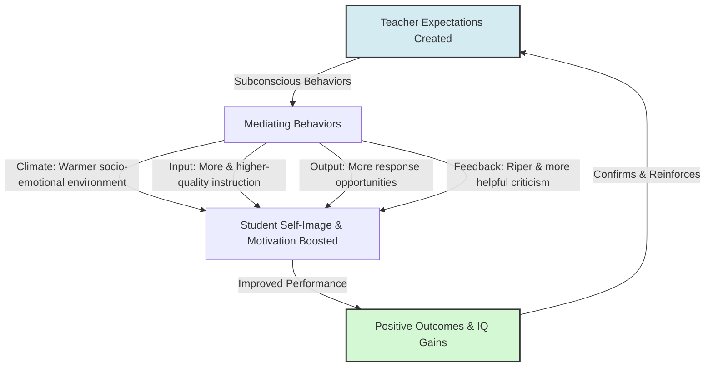

# Rosenthal-Jacobson Classroom Study

> The Rosenthal-Jacobson Classroom Study is a landmark 1968 educational psychology experiment that investigated the impact of teacher expectations on student intellectual growth, establishing the empirical basis for the Pygmalion effect.

## Overview

The study was conducted at "Oak School" by Robert Rosenthal and Lenore Jacobson in 1968. By falsely labeling randomly selected students as "intellectual bloomers" who were poised for sudden cognitive development, the researchers showed that teachers' positive expectations acted as a self-fulfilling prophecy, directly causing those students to achieve significantly greater IQ gains. It references the parent subtopic Historical and Mythological Roots and the bucket [[foundations|Foundations]] Map of Content (MOC).

## Key Points

- **Random Selection and Deception**: Researchers administered a standard IQ test but told teachers it was a proprietary test to identify students poised for dramatic cognitive growth. They then randomly assigned 20% of the students to the "bloomer" experimental group, meaning any differences in performance were solely due to teacher expectations.
- **Significant Intelligence Gains**: At the end of the school year, students falsely labeled as "bloomers" showed statistically significant increases in their IQ scores compared to the control group, proving that teacher beliefs could act as a self-fulfilling prophecy.
- **Pronounced Effect in Younger Grades**: The positive impact of high teacher expectations was most dramatic among younger children, particularly in the first and second grades. Older children were hypothesized to be less susceptible due to having more established reputations and greater cognitive stability.
- **The Four-Factor Theory**: Rosenthal later proposed four mediating factors (Climate, Input, Output, and Feedback) to explain how expectations are communicated. Teachers subconsciously create a warmer climate, teach more material, offer more response opportunities, and provide richer feedback to expected high-achievers.
- **Severe Methodological Critiques**: Critics like Thorndike and Snow challenged the study's validity, citing flaws in the TOGA testing instrument and regression to the mean. They argued that pre-test scores in young children were implausibly low and that the observed IQ gains were statistical artifacts rather than psychological effects.

## Diagram

## Connections

### Within The Pygmalion Effect
- [[the-concept-of-self-fulfilling-prophecy|The Concept of Self-Fulfilling Prophecy]] — The theoretical framework underpinning the experiment.
- [[rosenthal-climate-factor|Rosenthal Climate Factor]] — The emotional warmth element of the expectancy transmission model.
- [[rosenthal-input-factor|Rosenthal Input Factor]] — The instructional density element of expectancy transmission.
- [[rosenthal-output-factor|Rosenthal Output Factor]] — The student response opportunity element.
- [[rosenthal-feedback-factor|Rosenthal Feedback Factor]] — The constructive assessment element.
- [[teacher-expectations-and-student-tracking|Teacher Expectations and Student Tracking]] — The sociological impact on educational systems.
- [[methodological-critiques-of-classroom-studies|Methodological Critiques of Classroom Studies]] — The critical evaluations of the original study.

### Cross-Domain
- Sociology — Merton's self-fulfilling prophecy and institutionalized labeling.

## Sources

- Wikipedia: Pygmalion effect — https://en.wikipedia.org/wiki/Pygmalion_effect
- Simply Psychology: Pygmalion Effect In The Classroom (Rosenthal & Jacobson) — https://www.simplypsychology.org/pygmalion-effect.html
- The Decision Lab: The Pygmalion Effect — https://thedecisionlab.com/biases/the-pygmalion-effect

## Further Reading

- *Pygmalion in the Classroom* (Rosenthal & Jacobson, 1968): The original book detailing the experiment's background, design, data, and conclusions.
- *Review of Pygmalion in the Classroom* (Robert Thorndike, 1968): A concise, foundational critique detailing the psychometric flaws of the study's testing instrument.
- *The mediation of Pygmalion effects: A four-factor theory* (Robert Rosenthal, 1973): The article detailing the four factors that explain expectation mediation.

---
*Part of [[the-pygmalion-effect-Index]] · [[foundations|Foundations MOC]] · Historical and Mythological Roots*