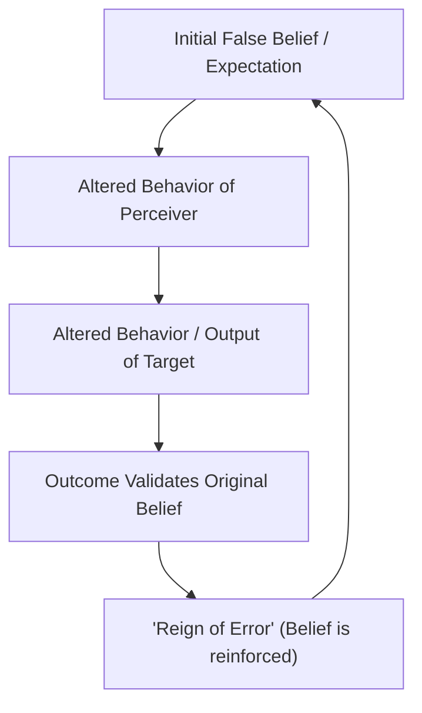

# The Concept of Self-Fulfilling Prophecy

> A self-fulfilling prophecy is a socio-psychological phenomenon where an initially false belief or expectation about a situation or individual evokes new behaviors that cause the false belief to come true.

## Overview

Formalized by sociologist Robert K. Merton in 1948, the self-fulfilling prophecy describes how subjective definitions of reality can produce actual, objective consequences. The process establishes what Merton called a "reign of error" where the observer mistakenly believes the final outcome validates their original, incorrect prediction, unaware that their own actions actually drove the outcome. It references the parent subtopic Historical and Mythological Roots and the bucket [[foundations|Foundations]] Map of Content (MOC).

## Key Points

- **The Initial False Definition**: The cycle begins with a false prediction, stereotype, or expectation about an individual, group, or situation.
- **Altered Behavioral Patterns**: Driven by the belief that this false definition is true, actors adapt their behaviors in ways that align with the expectation.
- **Manifestation of Reality**: These altered actions generate objective conditions and behaviors in others that ultimately force the initial falsehood to become true.
- **The Reign of Error**: Observers conclude their original prediction was correct all along, remaining completely unaware that their own actions catalyzed the outcome.
- **The Pygmalion Connection**: The Pygmalion Effect is a specific, positive interpersonal application of Merton's framework, where high expectations from an authority figure lead to behaviors that boost a target's performance.

## Diagram

## Connections

### Within The Pygmalion Effect
- [[mythological-origins-of-pygmalion|Mythological Origins of Pygmalion]] — The classical metaphor of shaping reality from expectation.
- [[rosenthal-jacobson-classroom-study|Rosenthal-Jacobson Classroom Study]] — The landmark experiment testing this concept in a school setting.
- [[behavioral-confirmation-processes|Behavioral Confirmation Processes]] — The active social interaction mechanisms that realize the prophecy.
- [[expectation-bias-and-confirmation-bias|Expectation Bias and Confirmation Bias]] — The cognitive biases that establish and maintain the initial false belief.
- [[the-golem-effect|The Golem Effect]] — The negative formulation of the self-fulfilling prophecy.

### Cross-Domain
- Sociology — Merton's self-fulfilling prophecy and institutionalized labeling.
- Philosophy of Mind — Belief-desire psychology and constructed reality.

## Sources

- Simply Psychology: Self-Fulfilling Prophecy — https://simplypsychology.org/self-fulfilling-prophecy.html
- Wikipedia: Self-fulfilling prophecy — https://wikipedia.org/wiki/Self-fulfilling_prophecy
- The Decision Lab: Self-Fulfilling Prophecy — https://thedecisionlab.com/biases/self-fulfilling-prophecy

## Further Reading

- "The Self-Fulfilling Prophecy" by Robert K. Merton (1948) in *The Antioch Review*: The original foundational paper defining the concept and explaining the socio-economic mechanisms.
- *Social Theory and Social Structure* by Robert K. Merton (1949): Provides the broader context of structural-functionalism and the role of social expectations in shaping institutional structures.
- *Pygmalion in the Classroom* by Robert Rosenthal and Lenore Jacobson (1968): The landmark educational psychology study that empirically demonstrated Merton's self-fulfilling prophecy within classroom teacher-student dynamics.

---
*Part of [[the-pygmalion-effect-Index]] · [[foundations|Foundations MOC]] · Historical and Mythological Roots*