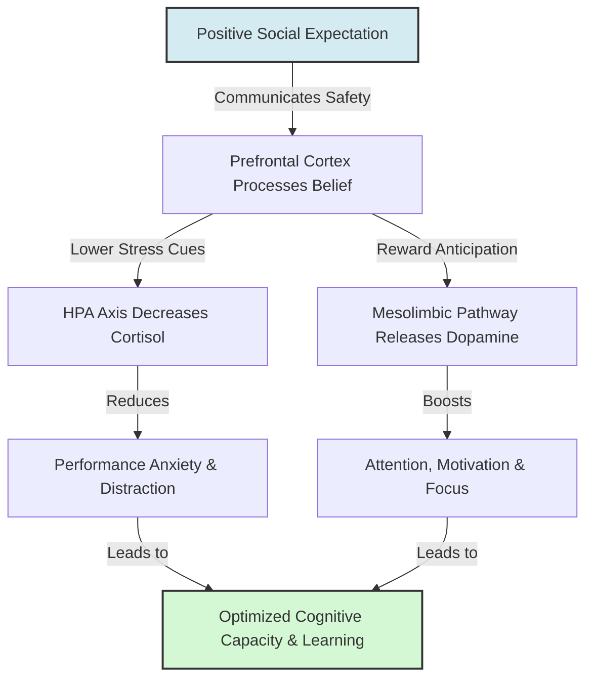

# Neurobiological Mediators of Expectation

> Neurobiological mediators of expectation represent the underlying neural pathways, neurotransmitters, and physiological stress systems that translate cognitive beliefs into physical bodily changes.

## Overview

While the Pygmalion Effect is traditionally studied through social and cognitive lenses, it relies on biological processes within the target. When an individual internalizes external expectations, the brain triggers biochemical changes involving neurotransmitter systems (dopamine, endogenous opioids) and endocrine responses (cortisol, adrenaline). These systems alter stress levels, motivation, attention, and cognitive capacity, establishing a physiological link between belief and performance. It references the parent subtopic Internal and Related Cognitive Effects and the bucket [[mechanisms|Mechanisms]] Map of Content (MOC).

## Key Points

- **Dopamine and Reward Anticipation**: Expectation of success activates the brain's mesolimbic reward system. Anticipating positive outcomes triggers dopamine release in the striatum and nucleus accumbens, boosting motivation, focus, and motor coordination.
- **Endogenous Opioids and Pain Modulation**: In placebo studies, the expectation of relief triggers the release of endorphins that bind to μ-opioid receptors in the brain and spinal cord, physically blocking pain signals. This process can be reversed chemically by naloxone, proving its physiological basis.
- **HPA Axis and Cortisol Regulation**: High external expectations communicate safety and support (Climate), reducing activity in the Hypothalamic-Pituitary-Adrenal (HPA) axis. This lowers cortisol (the stress hormone) and adrenaline, reducing performance anxiety.
- **Golem Effect and Cognitive Overload**: Conversely, low expectations (Golem effect) act as chronic stressors. The resulting increase in cortisol and anxiety impairs prefrontal cortex function, disrupting working memory, focus, and decision-making.
- **Neuroplasticity and Learning**: Positive environments and biological safety facilitate the release of neurotrophic factors (like BDNF), supporting synaptic plasticity, memory consolidation, and the acquisition of new skills.

## Diagram

## Connections

### Within The Pygmalion Effect
- [[the-concept-of-self-fulfilling-prophecy|The Concept of Self-Fulfilling Prophecy]] — The cognitive loops that activate these neural pathways.
- [[placebo-and-nocebo-effects|Placebo and Nocebo Effects]] — The medical and clinical manifestations of neurobiological expectations.
- [[the-galatea-effect|The Galatea Effect]] — How self-efficacy shifts the brain's internal reward systems.
- [[the-golem-effect|The Golem Effect]] — The negative stress response characterized by chronic cortisol elevation.
- [[rosenthal-climate-factor|Rosenthal Climate Factor]] — The interpersonal cues that signal safety and lower the target's threat response.

### Cross-Domain
- Neurobiology — Synaptic plasticity, dopamine pathways, and HPA axis functions.
- Medicine & Bioethics — The placebo response, physiological stress, and clinical methodology.

## Sources

- Fabrizio Benedetti (2008). *How Expectations Shape the Medicine and the Body*. Oxford University Press.
- Wikipedia: Placebo — https://en.wikipedia.org/wiki/Placebo
- Predrag Petrovic, et al. (2002). *Placebo and Opioid Analgesia - Imaging a Shared Neuronal Network*. Science.

## Further Reading

- *Placebo Effects: Understanding the mechanisms in health and disease* by Fabrizio Benedetti (2014): The leading textbook detailing the chemical and neurological mechanisms behind placebo and nocebo responses.
- *The Neurobiology of Human Expectancy* (various clinical neuroscience reviews): Explains the integration of reward systems and prefrontal cortex operations during predictive processing.

---
*Part of [[the-pygmalion-effect-Index]] · [[mechanisms|Mechanisms MOC]] · Internal and Related Cognitive Effects*