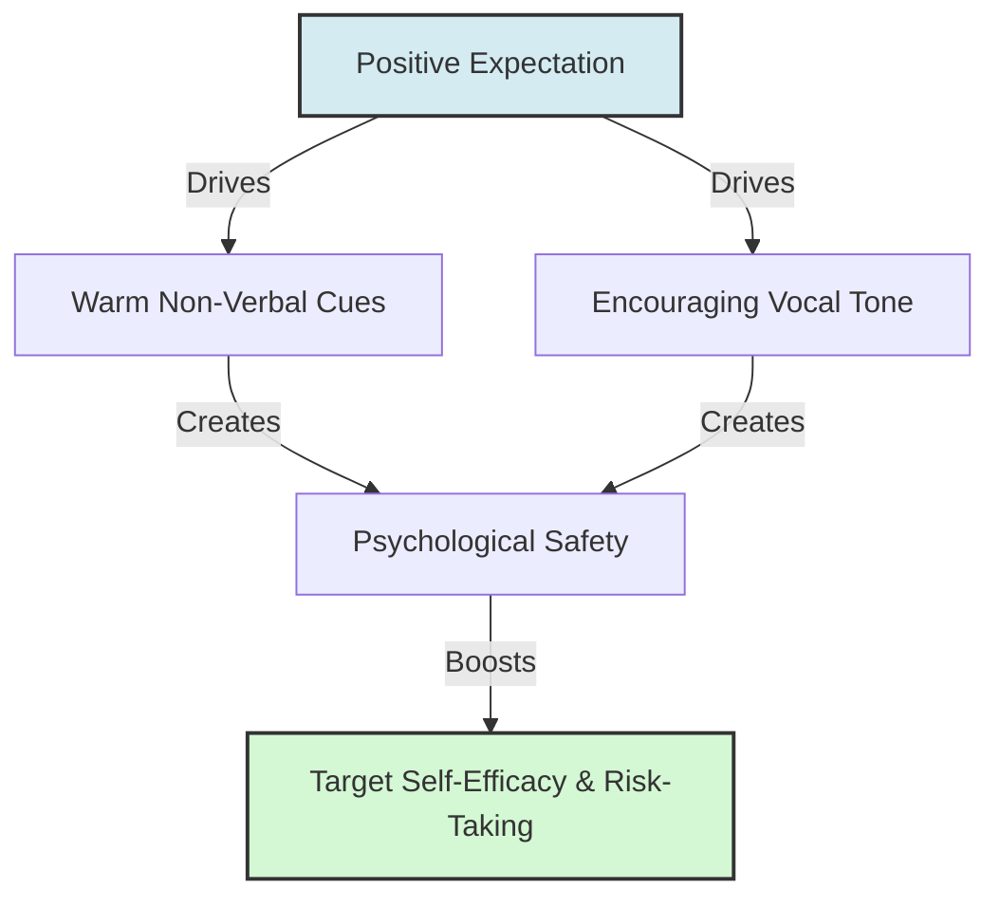

# Rosenthal Climate Factor

> The Rosenthal Climate factor is the socioemotional warmth and supportive psychological atmosphere created by an observer holding high expectations toward a target.

## Overview

As the first channel in Robert Rosenthal's four-factor theory of expectation transmission, the Climate factor focuses on how unconscious non-verbal cues and emotional demeanor communicate belief. When a leader or teacher holds high expectations, they create a warmer and more supportive environment, which fosters psychological safety, self-efficacy, and a willingness to take risks in the target. It references the parent subtopic Rosenthal's Four-Factor Model and the bucket [[mechanisms|Mechanisms]] Map of Content (MOC).

## Key Points

- **Non-Verbal Cues**: The Climate factor is communicated primarily through non-verbal channels, including increased eye contact, nodding, smiling, leaning in during interactions, and adopting an open posture.
- **Vocal Warmth**: Vocal tone, pitch, and pacing convey support and warmth. Teachers or managers who expect high performance use a more encouraging, attentive, and less critical tone.
- **Psychological Safety**: By creating a warm socioemotional environment, the observer reduces the target's fear of failure. This safety is critical for cognitive risk-taking, exploration, and learning.
- **Subconscious Transmission**: Observers are rarely conscious of the difference in climate they create. The shift in behavior is automatic, driven by their underlying expectation and confirmation biases.
- **Impact on Self-Efficacy**: The target perceives this warm climate, even if unconsciously. It signals that they are valued, capable, and trusted, which directly boosts their self-efficacy and motivation.

## Diagram

## Connections

### Within The Pygmalion Effect
- [[rosenthal-input-factor|Rosenthal Input Factor]] — The content and challenge level offered to the target.
- [[rosenthal-output-factor|Rosenthal Output Factor]] — The response opportunities provided to the target.
- [[rosenthal-feedback-factor|Rosenthal Feedback Factor]] — The reinforcement and assessment provided to the target.
- [[rosenthal-jacobson-classroom-study|Rosenthal-Jacobson Classroom Study]] — The experiment where the four factors were first observed and formulated.
- [[expectation-bias-and-confirmation-bias|Expectation Bias and Confirmation Bias]] — The cognitive mechanisms driving the creation of a warmer climate.

### Cross-Domain
- Organizational Behavior — Trust, leadership communication, and psychological safety in teams.
- Sociology — Interpersonal cueing and emotional labor.

## Sources

- Wikipedia: Pygmalion effect — https://en.wikipedia.org/wiki/Pygmalion_effect
- Simply Psychology: Pygmalion Effect In The Classroom (Rosenthal & Jacobson) — https://www.simplypsychology.org/pygmalion-effect.html
- Robert Rosenthal (1973). *The mediation of Pygmalion effects: A four-factor theory*. Papua New Guinea Journal of Education.

## Further Reading

- *The mediation of Pygmalion effects: A four-factor theory* (Robert Rosenthal, 1973): Explains the conceptual and empirical development of the four-factor model.
- *Psychological Safety and Learning Behavior in Work Teams* by Amy Edmondson (1999): Explores how interpersonal climate and safety influence group-level performance and learning.

---
*Part of [[the-pygmalion-effect-Index]] · [[mechanisms|Mechanisms MOC]] · Rosenthal's Four-Factor Model*