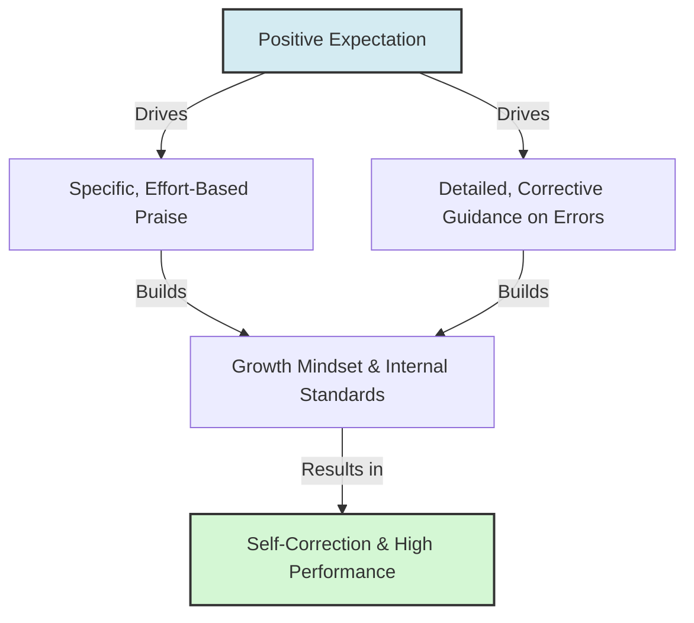

# Rosenthal Feedback Factor

> The Rosenthal Feedback factor is the specificity, frequency, and constructiveness of performance evaluation and reinforcement provided to a target based on expectations.

## Overview

As the fourth and final channel in Robert Rosenthal's four-factor theory of expectation transmission, the Feedback factor examines the evaluative responses to a target's performance. When observers hold high expectations, they provide more frequent, detailed, and constructive feedback, offering praise for success and rich guidance on how to correct errors. Conversely, low expectations result in simple, vague, or purely critical responses, depriving the target of the corrective learning inputs required to improve. It references the parent subtopic Rosenthal's Four-Factor Model and the bucket [[mechanisms|Mechanisms]] Map of Content (MOC).

## Key Points

- **Detailed Praise**: Praise given to high-expectation targets is specific, tying success to effort and ability rather than luck, which reinforces a growth mindset.
- **Constructive Criticism**: Errors committed by favored individuals are treated as temporary learning opportunities. Observers provide detailed explanations of what went wrong and how to fix it.
- **Praise/Criticism Inversion**: Low-expectation targets are often praised for simple, mediocre tasks (which subtly signals low expectations of their capability) and criticized destructively for failures without guidance.
- **Reinforcement Schedules**: High-expectation targets receive consistent, contingent reinforcement that clarifies the path to success, which helps them regulate their own efforts.
- **Internalization of Standards**: Rich feedback teaches the target the standard of excellence, helping them internalize high criteria and self-regulate their own performance.

## Diagram

## Connections

### Within The Pygmalion Effect
- [[rosenthal-climate-factor|Rosenthal Climate Factor]] — The supportive environment that ensures criticism is received constructively.
- [[rosenthal-input-factor|Rosenthal Input Factor]] — The content difficulty level that necessitates detailed, corrective feedback.
- [[rosenthal-output-factor|Rosenthal Output Factor]] — The response opportunities that generate the performance requiring feedback.
- [[rosenthal-jacobson-classroom-study|Rosenthal-Jacobson Classroom Study]] — The study where differential evaluative feedback was first analyzed.
- [[the-galatea-effect|The Galatea Effect]] — How constructive feedback helps build self-expectations and self-efficacy.

### Cross-Domain
- Organizational Behavior — Performance appraisal, coaching, and growth-oriented feedback loops.
- Sociology — Interpersonal reinforcement and institutional sorting.

## Sources

- Wikipedia: Pygmalion effect — https://en.wikipedia.org/wiki/Pygmalion_effect
- Simply Psychology: Pygmalion Effect In The Classroom (Rosenthal & Jacobson) — https://www.simplypsychology.org/pygmalion-effect.html
- Robert Rosenthal (1973). *The mediation of Pygmalion effects: A four-factor theory*. Papua New Guinea Journal of Education.

## Further Reading

- *The mediation of Pygmalion effects: A four-factor theory* (Robert Rosenthal, 1973): Explains the conceptual and empirical development of the four-factor model.
- *Mindset: The New Psychology of Success* by Carol S. Dweck (2006): Explains how specific feedback shapes growth vs. fixed mindsets, mirroring Rosenthal's feedback dynamics.

---
*Part of [[the-pygmalion-effect-Index]] · [[mechanisms|Mechanisms MOC]] · Rosenthal's Four-Factor Model*