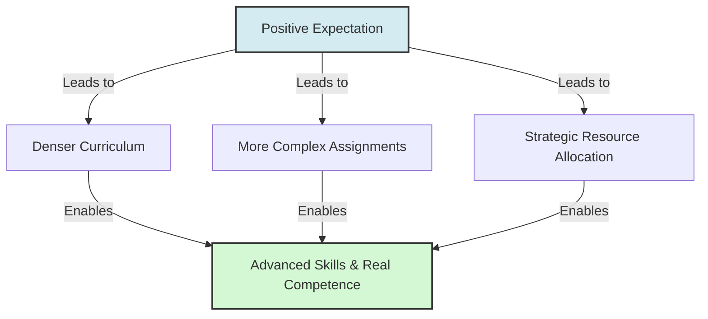

# Rosenthal Input Factor

> The Rosenthal Input factor is the quantity and quality of teaching, information, and challenging material provided by an observer to a target they expect to excel.

## Overview

As the second channel in Robert Rosenthal's four-factor theory of expectation transmission, the Input factor describes the actual content of the interaction. When an observer (such as a teacher or manager) holds high expectations for an individual, they tend to teach more material, introduce more complex concepts, and set higher difficulty levels. This provides the target with rich developmental resources that physically enable superior outcomes. It references the parent subtopic Rosenthal's Four-Factor Model and the bucket [[mechanisms|Mechanisms]] Map of Content (MOC).

## Key Points

- **Content Density**: Teachers teach more material and move through curricula faster with students they perceive as high-potential.
- **Cognitive Challenge**: Observers assign more complex, abstract, and difficult tasks to favored targets, pushing them to develop advanced problem-solving skills.
- **Resource Allocation**: Managers allocate higher-value resources, budgets, and strategic assignments to employees they expect to perform at a high level.
- **Differential Opportunity**: Individuals expected to underperform are given repetitive, simple tasks and watered-down information, which curtails their developmental trajectory.
- **Creation of Competence**: The input factor shows that the Pygmalion Effect is not just motivational; it is structural. High expectations result in the actual delivery of superior instruction and materials, physically creating competence.

## Diagram

## Connections

### Within The Pygmalion Effect
- [[rosenthal-climate-factor|Rosenthal Climate Factor]] — The emotional warmth that supports the presentation of challenging material.
- [[rosenthal-output-factor|Rosenthal Output Factor]] — The opportunities provided to the target to practice and demonstrate learning.
- [[rosenthal-feedback-factor|Rosenthal Feedback Factor]] — The detailed evaluation that guides the target's work on dense inputs.
- [[rosenthal-jacobson-classroom-study|Rosenthal-Jacobson Classroom Study]] — The study where differential teaching inputs were first identified.
- [[teacher-expectations-and-student-tracking|Teacher Expectations and Student Tracking]] — The systemic practice of adjusting input quality based on tracks.

### Cross-Domain
- Organizational Behavior — Strategic delegation, training programs, and resource allocation.
- Sociology — The distribution of cultural capital and educational opportunities.

## Sources

- Wikipedia: Pygmalion effect — https://en.wikipedia.org/wiki/Pygmalion_effect
- Simply Psychology: Pygmalion Effect In The Classroom (Rosenthal & Jacobson) — https://www.simplypsychology.org/pygmalion-effect.html
- Robert Rosenthal (1973). *The mediation of Pygmalion effects: A four-factor theory*. Papua New Guinea Journal of Education.

## Further Reading

- *The mediation of Pygmalion effects: A four-factor theory* (Robert Rosenthal, 1973): Explains the conceptual and empirical development of the four-factor model.
- *Classrooms: Social contexts for work and play* by Richard A. Schmuck and Patricia A. Schmuck (2001): Discusses the impact of instruction quality and class organization on student social development.

---
*Part of [[the-pygmalion-effect-Index]] · [[mechanisms|Mechanisms MOC]] · Rosenthal's Four-Factor Model*