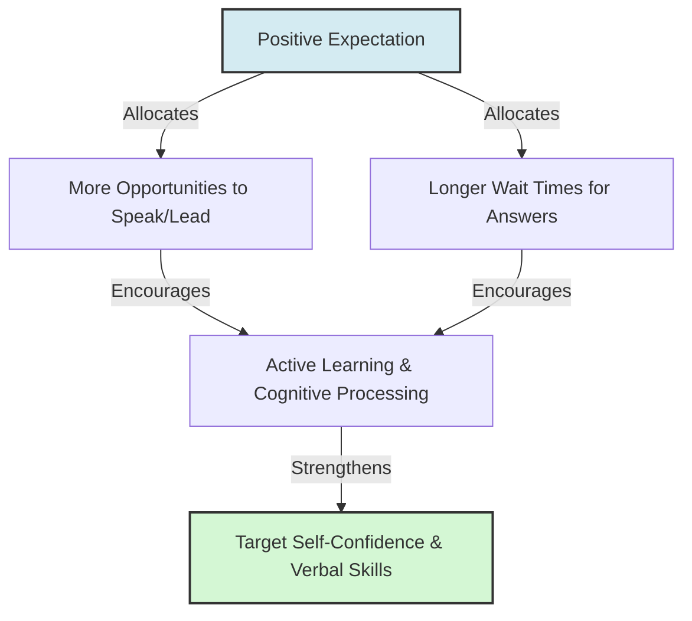

# Rosenthal Output Factor

> The Rosenthal Output factor (also known as response opportunity) is the degree to which an observer provides a target with opportunities to respond, initiate, and actively participate.

## Overview

As the third channel in Robert Rosenthal's four-factor theory of expectation transmission, the Output factor describes how leaders or teachers allocate verbal and behavioral space to targets. When an observer holds positive expectations for an individual, they tend to call on them more frequently, wait longer for their responses, and encourage active participation. This increased engagement enables the target to practice skills, build verbal confidence, and refine their cognitive processes. It references the parent subtopic Rosenthal's Four-Factor Model and the bucket [[mechanisms|Mechanisms]] Map of Content (MOC).

## Key Points

- **Response Frequency**: Teachers call on "high-expectation" students more often, allowing them more opportunities to answer questions in front of peers.
- **Wait Time Allocation**: When asking a question, observers wait longer for a response from individuals they expect to know the answer. Giving more time allows for deeper cognitive processing and reduces anxiety.
- **Encouragement of Autonomy**: Managers allow favored employees more autonomy and opportunities to lead meetings, propose projects, and express independent ideas.
- **Active Engagement**: High output opportunities translate into active learning and skill rehearsal, which is far more effective for competence development than passive listening.
- **Confidence Building**: Being repeatedly asked to contribute and having one's contributions valued builds the target's public confidence and self-efficacy.

## Diagram

## Connections

### Within The Pygmalion Effect
- [[rosenthal-climate-factor|Rosenthal Climate Factor]] — The supportive environment that encourages the target to utilize response opportunities.
- [[rosenthal-input-factor|Rosenthal Input Factor]] — The intellectual content that prepares the target to respond effectively.
- [[rosenthal-feedback-factor|Rosenthal Feedback Factor]] — The detailed evaluation given after the target utilizes an output opportunity.
- [[rosenthal-jacobson-classroom-study|Rosenthal-Jacobson Classroom Study]] — The classroom study where response opportunities were first quantified.
- [[the-galatea-effect|The Galatea Effect]] — How increased output opportunities lead to higher self-expectations and self-efficacy.

### Cross-Domain
- Organizational Behavior — Employee empowerment, delegation, and voice in decision-making.
- Sociology — Classroom interaction analysis and conversational turn-taking.

## Sources

- Wikipedia: Pygmalion effect — https://en.wikipedia.org/wiki/Pygmalion_effect
- Simply Psychology: Pygmalion Effect In The Classroom (Rosenthal & Jacobson) — https://www.simplypsychology.org/pygmalion-effect.html
- Robert Rosenthal (1973). *The mediation of Pygmalion effects: A four-factor theory*. Papua New Guinea Journal of Education.

## Further Reading

- *The mediation of Pygmalion effects: A four-factor theory* (Robert Rosenthal, 1973): Explains the conceptual and empirical development of the four-factor model.
- *Wait-time and rewards as instructional variables, their influence in language, science, and public policy* by Mary Budd Rowe (1974): Foundational research proving that waiting longer for student answers dramatically improves student cognitive complexity.

---
*Part of [[the-pygmalion-effect-Index]] · [[mechanisms|Mechanisms MOC]] · Rosenthal's Four-Factor Model*