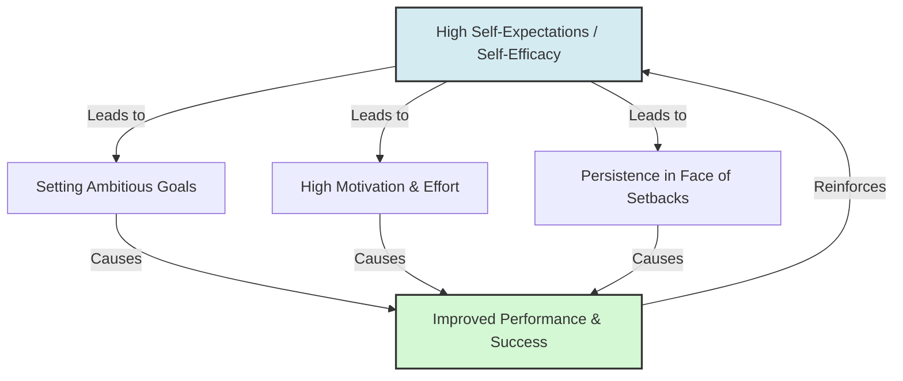

# The Galatea Effect

> The Galatea Effect is a psychological phenomenon where an individual's own high self-expectations and self-efficacy lead to improved performance.

## Overview

Unlike the Pygmalion Effect, which is driven by the expectations of *others* (such as a manager or teacher), the Galatea Effect represents an *internal* self-fulfilling prophecy. When a person believes in their own capacity to succeed, they set higher goals, exert greater effort, and persevere through difficulties, leading to superior achievements. In management and psychology, this is considered a key mediator of external expectation effects. It references the parent subtopic Internal and Related Cognitive Effects and the bucket [[mechanisms|Mechanisms]] Map of Content (MOC).

## Key Points

- **Self-Expectations as Driver**: The primary driver is the target's internal self-concept and self-efficacy (their belief in their ability to perform a specific task).
- **Goal Setting and Persistence**: Individuals with high self-expectations set more ambitious goals and display higher persistence when facing failures, viewing setbacks as learning opportunities.
- **Relationship to Pygmalion**: The Galatea Effect is often the internal mechanism that makes the Pygmalion Effect work. When a leader communicates high expectations (Pygmalion), the employee internalizes these expectations, raising their own self-expectations (Galatea).
- **Independent Operation**: The Galatea Effect can operate independently of others' expectations. A self-motivated individual can excel even under low external expectations if their self-efficacy remains high.
- **Practical Application**: In training and development, raising an individual's self-efficacy through skill mastery and vicarious modeling directly triggers the Galatea Effect, fostering long-term performance.

## Diagram

## Connections

### Within The Pygmalion Effect
- [[the-concept-of-self-fulfilling-prophecy|The Concept of Self-Fulfilling Prophecy]] — The core cognitive feedback loop applied to self-belief.
- [[the-golem-effect|The Golem Effect]] — The negative counterpart where low expectations stifle performance.
- [[livingston-pygmalion-in-management|Livingston Pygmalion in Management]] — The HBR application where manager beliefs are translated into employee self-belief.
- [[collective-efficacy-and-team-pygmalion|Collective Efficacy and Team Pygmalion]] — The group-level equivalent of self-efficacy.
- [[rosenthal-climate-factor|Rosenthal Climate Factor]] — How external warmth communicates belief that shifts internal self-expectations.

### Cross-Domain
- Organizational Behavior — Motivation theory, task design, and employee development.
- Philosophy of Mind — Self-concept, agency, and belief-driven action.

## Sources

- Wikipedia: Galatea effect — https://en.wikipedia.org/wiki/Galatea_effect
- Albert Bandura (1977). *Self-efficacy: Toward a Unifying Theory of Behavioral Change*. Psychological Review.
- J. Sterling Livingston (1969). *Pygmalion in Management*. Harvard Business Review.

## Further Reading

- *Self-efficacy: The exercise of control* by Albert Bandura (1997): The definitive book on self-efficacy and how beliefs dictate behavior and achievement.
- *Pygmalion in Management* by J. Sterling Livingston (1969): Seminal HBR article detailing the translation of manager expectations into employee self-expectations.

---
*Part of [[the-pygmalion-effect-Index]] · [[mechanisms|Mechanisms MOC]] · Internal and Related Cognitive Effects*