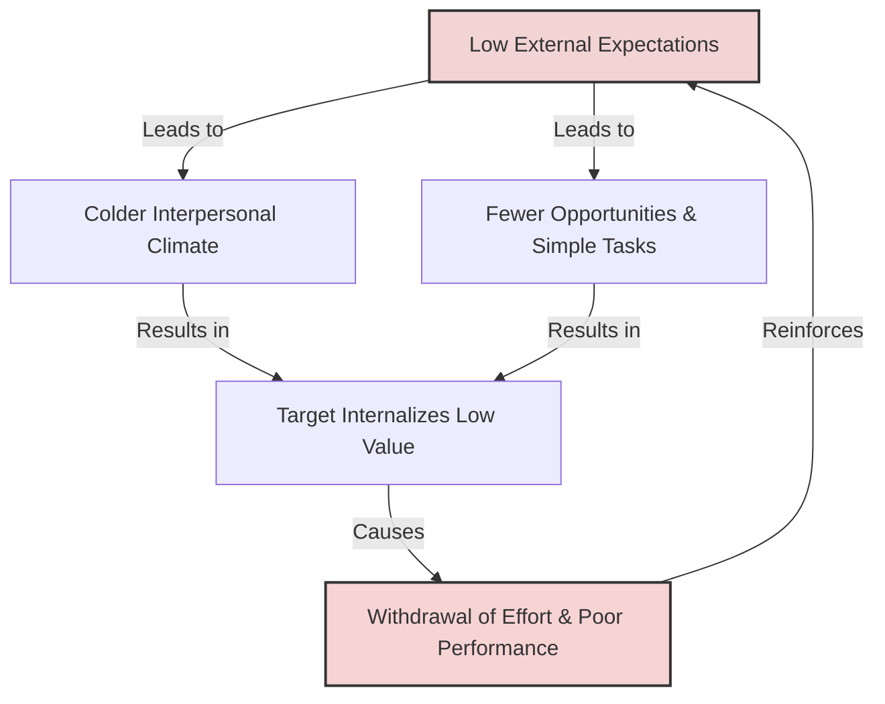

# The Golem Effect

> The Golem Effect is a psychological phenomenon where low expectations placed upon an individual by an authority figure lead to poorer performance and diminished outcomes.

## Overview

The Golem Effect is the negative counterpart to the Pygmalion Effect. Named after the Golem of Jewish folklore—a clay creature brought to life to protect, but which can run amok and destroy—this effect illustrates how destructive, low expectations can stifle potential. When a teacher, manager, or coach holds negative expectations, their verbal and non-verbal behaviors communicate distrust and low value, which the target internalizes, resulting in decreased motivation, withdrawal of effort, and actual performance decline. It references the parent subtopic Internal and Related Cognitive Effects and the bucket [[mechanisms|Mechanisms]] Map of Content (MOC).

## Key Points

- **Low-Expectation Transmission**: Like the Pygmalion effect, the Golem effect operates through Climate, Input, Output, and Feedback. Authority figures holding low expectations create a colder climate, teach less material, offer fewer response opportunities, and provide poor or purely critical feedback.
- **Internalization of Low Worth**: The target senses these negative cues and internalizes them, leading to a drop in self-efficacy and self-esteem. They begin to think: "Why try if I am expected to fail?"
- **Behavioral Withdrawal**: To protect their self-worth from repeated failure, individuals under negative expectations often withdraw their effort, exhibit avoidance behavior, or engage in self-handicapping.
- **The Self-Fulfilling Loop**: The target's resulting poor performance is viewed by the observer as validation of their initial low opinion, cementing the negative bias and reinforcing the cycle.
- **Organizational Harm**: In workplaces and schools, the Golem Effect leads to systemic underachievement, high turnover, and toxic climates. Elisha Babad extensively studied these effects in classrooms, showing how easily teachers unconsciously communicate negative bias.

## Diagram

## Connections

### Within The Pygmalion Effect
- [[the-concept-of-self-fulfilling-prophecy|The Concept of Self-Fulfilling Prophecy]] — The core sociological loop driving the expectation cycle.
- [[the-galatea-effect|The Galatea Effect]] — The internal positive contrast of self-belief.
- [[livingston-pygmalion-in-management|Livingston Pygmalion in Management]] — The management paper detailing the cost of negative leadership beliefs.
- [[teacher-expectations-and-student-tracking|Teacher Expectations and Student Tracking]] — How lower academic tracks institutionalize the Golem effect.
- [[rosenthal-climate-factor|Rosenthal Climate Factor]] — The emotional warmth variable that is missing or inverted in the Golem effect.

### Cross-Domain
- Sociology — Stereotype threat, labeling, and systemic discrimination.
- Organizational Behavior — Toxic leadership, employee disengagement, and psychological unsafety.

## Sources

- Wikipedia: Golem effect — https://en.wikipedia.org/wiki/Golem_effect
- Elisha Babad, Jacinto Inbar, and Robert Rosenthal (1982). *Pygmalion, Galatea, and the Golem in the Classroom*. Journal of Educational Psychology.
- J. Sterling Livingston (1969). *Pygmalion in Management*. Harvard Business Review.

## Further Reading

- *Pygmalion, Galatea, and the Golem in the Classroom* (Babad, Inbar, & Rosenthal, 1982): First major empirical study that explicitly contrasted Pygmalion and Golem effects within education settings.
- *The Golem Effect: A Meta-Analysis of Low Expectancy and Performance* (various reviews in organizational behavior): Discusses the massive financial and cultural costs of Golem-style management in modern business.

---
*Part of [[the-pygmalion-effect-Index]] · [[mechanisms|Mechanisms MOC]] · Internal and Related Cognitive Effects*