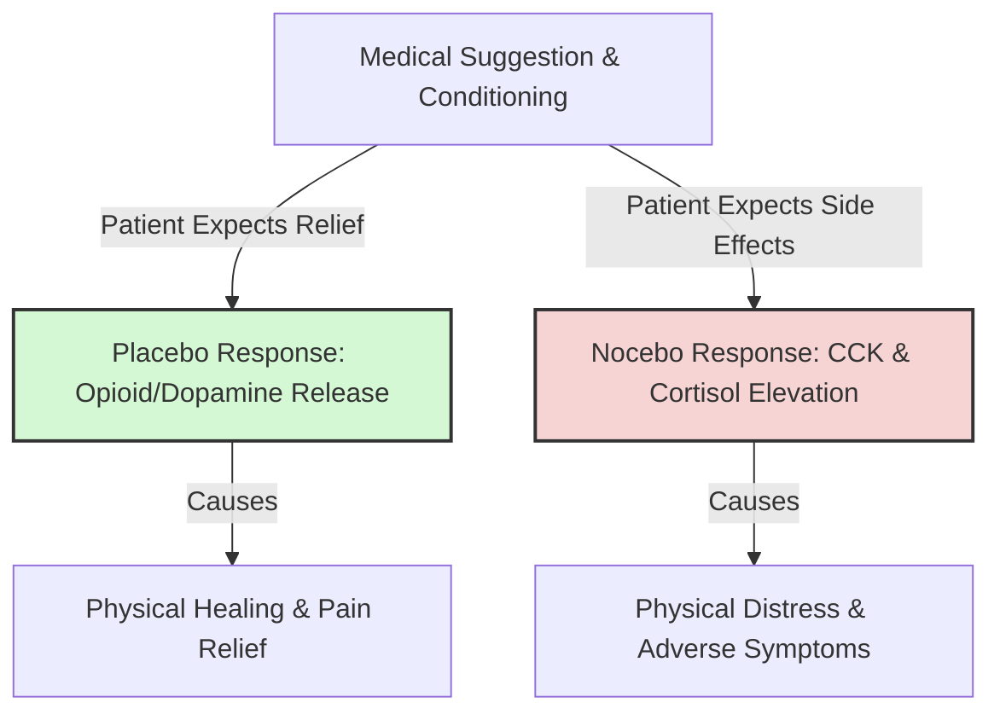

# Placebo and Nocebo Effects

> The Placebo and Nocebo Effects are clinical phenomena where a patient's positive or negative expectations about a medical treatment trigger actual physiological healing or adverse side effects, independent of any active pharmacological agent.

## Overview

The placebo and nocebo effects represent the medical and physiological equivalents of the Pygmalion and Golem effects. When a patient believes that a substance (like a sugar pill or saline injection) will cure their pain, their expectation activates real biochemical pathways in the brain (such as releasing endorphins or dopamine), resulting in physical healing. Conversely, expecting side effects (nocebo) can trigger stress responses and physical discomfort, showing the powerful bodily impact of belief. It references the parent subtopic Pygmalion in Medicine, Sports, and Research and the bucket [[applications-implications|Applications & Implications]] Map of Content (MOC).

## Key Points

- **Placebo (I Shall Please)**: A beneficial health outcome resulting from the patient's expectation of relief. It operates via the release of endogenous opioids (endorphins) and dopamine in reward and pain-control centers of the brain.
- **Nocebo (I Shall Harm)**: An adverse reaction or side effect resulting from the patient's negative expectations. Expecting pain can trigger the release of cholecystokinin (CCK), which amplifies pain perception, and elevate anxiety-related cortisol.
- **The Role of Suggestion**: Verbal cues from physicians, the appearance of the pill (size, color, brand name), and the medical environment all communicate expectations that modulate the strength of the effect.
- **Classical Conditioning**: Placebo responses are also shaped by past experiences. Having felt relief after taking pills in the past conditions the body to release healing chemicals when presented with similar visual and sensory cues.
- **Trial Controls**: Because expectation effects are so powerful in medicine, all new pharmaceuticals must be tested against a placebo control group in double-blind trials to prove that the drug has a chemical effect beyond suggestion.

## Diagram

## Connections

### Within The Pygmalion Effect
- [[neurobiological-mediators-of-expectation|Neurobiological Mediators of Expectation]] — The detailed biological pathways (endorphins, cortisol) of expectation.
- [[the-concept-of-self-fulfilling-prophecy|The Concept of Self-Fulfilling Prophecy]] — The core cognitive feedback loops translated to physical health.
- [[the-galatea-effect|The Galatea Effect]] — The internal analog of self-expectation in healing.
- [[the-golem-effect|The Golem Effect]] — The negative clinical analogue represented by the nocebo effect.
- [[experimenter-expectancy-effect|Experimenter Expectancy Effect]] — Why double-blind designs are mandatory in clinical trials.
- [[pygmalion-in-healthcare|Pygmalion in Healthcare]] — Clinician expectations shaping patient recovery and clinical decisions.

### Cross-Domain
- Medicine & Bioethics — Medical ethics, clinical trial design, and patient care.
- Neurobiology — Pain pathways, endogenous opioids, and reward systems.

## Sources

- Fabrizio Benedetti (2008). *How Expectations Shape the Medicine and the Body*. Oxford University Press.
- Wikipedia: Placebo — https://en.wikipedia.org/wiki/Placebo
- The Decision Lab: The Placebo Effect — https://thedecisionlab.com/biases/the-placebo-effect

## Further Reading

- *Placebo Effects: Understanding the mechanisms in health and disease* by Fabrizio Benedetti (2014): The leading textbook detailing the chemical and neurological mechanisms behind placebo and nocebo responses.
- *The Placebo Effect: An Interdisciplinary Exploration* by Anne Harrington (1999): A comprehensive historical and biological review of expectation-driven medicine.

---
*Part of [[the-pygmalion-effect-Index]] · [[applications-implications|Applications & Implications MOC]] · Pygmalion in Medicine, Sports, and Research*