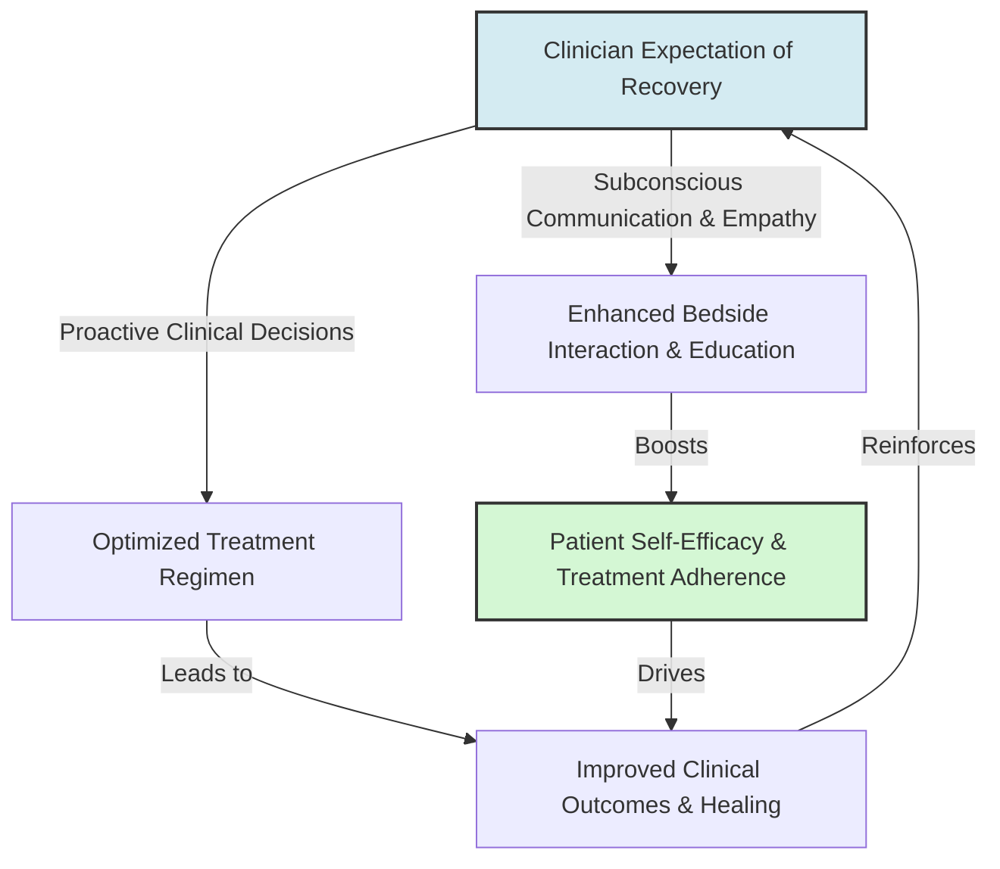

# Pygmalion in Healthcare

> Pygmalion in Healthcare refers to the phenomenon where a healthcare provider's positive expectations regarding a patient's recovery, treatment compliance, or capacity for self-care subconsciously influence the provider's communication, empathy, and treatment decisions, thereby improving clinical outcomes.

## Overview

In clinical settings, providers form subconscious assumptions about patients based on factors such as diagnosis severity, socioeconomic background, age, or past compliance history. These assumptions establish expectancy feedback loops: when clinicians hold positive expectations (the Pygmalion effect), they tend to deliver more warm, collaborative care, offer clearer health education, and provide proactive treatment options. This boosts patient self-efficacy and treatment adherence. Conversely, low clinician expectations can trigger the Golem effect, leading to clinical neglect or premature withdrawal of care. It references the parent subtopic Pygmalion in Medicine, Sports, and Research and the bucket [[applications-implications|Applications & Implications]] Map of Content (MOC).

## Key Points

- **Provider Attitude and Empathy**: Healthcare workers holding high expectations for recovery interact with greater warmth and empathy, communicating trust and verbal reinforcement that helps the patient feel capable of healing.
- **Treatment Adherence (Input)**: Clinicians with high recovery expectations spend more time explaining treatment regimens, answering questions, and teaching self-management skills to patients.
- **Prognostic Bias and Neuroprognostication**: In critical care, expectations can dictate life-or-death decisions. Premature withdrawal of life-sustaining treatment due to an expectation of poor recovery can turn a prognosis into a self-ful-filling prophecy.
- **Patient Self-Efficacy (Galatea Effect)**: When patients perceive their provider's confidence, it reinforces their own belief in their ability to manage their condition (self-efficacy), directly improving adherence to medication and therapy.
- **Provider Behavior Alterations**: The Pygmalion effect operates through subtle non-verbal cues (eye contact, tone of voice, time spent at bedside) that signal to the patient whether their recovery is expected and valued.

## Diagram

## Connections

### Within The Pygmalion Effect
- [[placebo-and-nocebo-effects|Placebo and Nocebo Effects]] — The physiological counterparts where patient beliefs trigger biochemical healing or symptoms.
- [[neurobiological-mediators-of-expectation|Neurobiological Mediators of Expectation]] — The neurological mechanism (endorphins, cortisol) mediating expectancy-driven healing.
- [[the-golem-effect|The Golem Effect]] — The negative clinical cycle resulting from low provider expectations and biases.
- [[the-galatea-effect|The Galatea Effect]] — How patients' self-expectations drive their own recovery motivation and pain tolerance.
- [[ethical-implications-of-expectancy-effects|Ethical Implications of Expectancy Effects]] — The clinical and ethical duty of healthcare professionals to recognize and combat expectancy biases.

### Cross-Domain
- Medicine & Bioethics — Clinical decision-making, patient-centered care, and medical ethics.
- Neurobiology — Physiological pathways linking patient perception and endocrine responses.

## Sources

- Fabrizio Benedetti (2008). *How Expectations Shape the Medicine and the Body*. Oxford University Press.
- World Health Organization: Patient-Centered Care — https://www.who.int/
- National Institutes of Health: Expectancy and Clinician-Patient Interactions — https://www.ncbi.nlm.nih.gov/pmc/articles/PMC6099043/

## Further Reading

- *Clinician Expectations and Patient Outcomes* (medical psychology review): Examines how caregiver attitudes systematically influence recovery speed and therapy compliance in rehabilitation settings.
- *The Self-Fulfilling Prophecy in Medicine* by R. Rosenthal (clinical trials literature): Focuses on the history of expectancy effects within diagnostic assessments and physician-patient dialogue.

---
*Part of [[the-pygmalion-effect-Index]] · [[applications-implications|Applications & Implications MOC]] · Pygmalion in Medicine, Sports, and Research*
