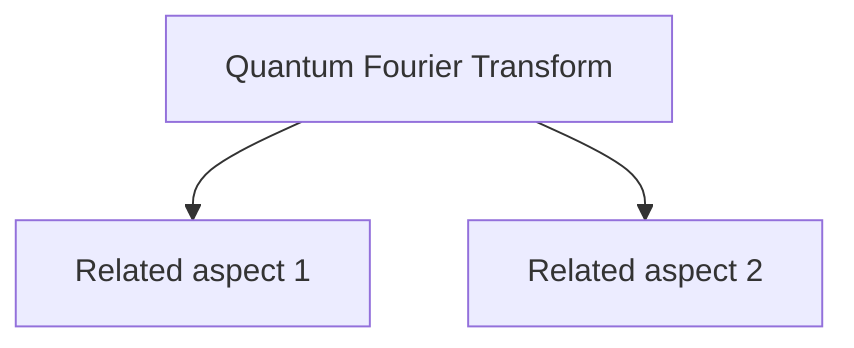

# Quantum Fourier Transform

> A precise definition of Quantum Fourier Transform.

## Overview

This is an overview of Quantum Fourier Transform. It connects directly to [[Quantum Algorithms]] and is a core part of the [[algorithms-and-applications]] map of content.

## Key Points

- **Point 1**: Detail 1 about Quantum Fourier Transform.
- **Point 2**: Detail 2 about Quantum Fourier Transform.
- **Point 3**: Detail 3 about Quantum Fourier Transform.
- **Point 4**: Detail 4 about Quantum Fourier Transform.
- **Point 5**: Detail 5 about Quantum Fourier Transform.

## Diagram

## Connections

### Within Quantum Computing
- [[Quantum Key Distribution]] — Related because it provides basis.
- [[BB84 Protocol]] — Another related concept.
- [[Post-Quantum Cryptography]] — Further connection in the graph.
- [[Superposition]] — Essential for building deeper understanding.
- [[Quantum Entanglement]] — Intersects in application.
- [[Quantum Algorithms]] — Parent subtopic.
- [[algorithms-and-applications]] — Parent MOC.

### Cross-Domain
- [[Physics]] — Theoretical foundation.
- [[Computer Science]] — Algorithmic implementation.

## Sources

- Wikipedia: Quantum Computing — https://en.wikipedia.org/wiki/Quantum_computing
- IBM Quantum — https://www.ibm.com/topics/quantum-computing
- Quantum Computing Resources — https://quantum-computing.ibm.com/

## Further Reading

- *Quantum Computation and Quantum Information* by Nielsen & Chuang — Standard textbook.
- *Quantum Computing Since Democritus* by Scott Aaronson — Excellent overview.

---
*Part of [[Quantum Computing-Index]] · [[algorithms-and-applications]] MOC · [[Quantum Algorithms]]*
